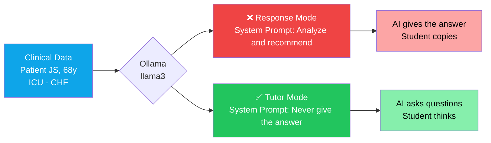
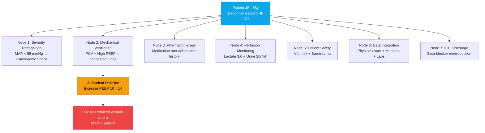

<p align="center">
  <strong>
    <h1 align="center">Clinical AI Tutor Demo</h1>
  </strong>
  <p align="center">
    <em>The AI that does NOT answer teaches more than the AI that answers.</em>
  </p>
</p>

<p align="center">
  <a href="#quick-start"></a>
  <a href="LICENSE"></a>
  <a href="https://ollama.com"></a>
  <a href="https://hl7.org/fhir/R4/"></a>
  <a href="https://www.langchain.com"></a>
  <a href="https://ppginfos.ufsc.br"></a>
</p>

<p align="center">
  🇺🇸 <strong>English</strong> (current) · 
  🇧🇷 <a href="docs/README_PT.md">Português</a> · 
  🇪🇸 <a href="docs/README_ES.md">Español</a> · 
  🇮🇹 <a href="docs/README_IT.md">Italiano</a>
</p>

---

## What Is This?

A single demonstration that reveals the **fundamental difference** between two AI modes in clinical education — using the **exact same LLM**, the **exact same patient**, and the **exact same student decision**. The only variable is the **system prompt**.

> [!IMPORTANT]
> This is **not** a chatbot. It is a controlled experiment that shows how prompt design transforms a generic AI into a clinical educator.

---

## Architecture



---

## Clinical Scenario & Learning Nodes



---

## The Core Insight

> [!NOTE]
> **The AI that does NOT answer is more valuable than the AI that answers.**
>
> In clinical education, a **generic AI** gives the answer — the student **copies**.
> A **tutor AI** asks questions — the student **thinks**.
>
> Same model. Same patient. **Different prompt design.**

---

## Response Mode vs. Tutor Mode

| | ❌ **Response Mode** | ✅ **Tutor Mode** |
|---|---|---|
| **Instruction** | *"Analyze and recommend the correct approach"* | *"NEVER give the answer — ask questions"* |
| **Behavior** | Delivers complete clinical analysis | Asks 2–3 targeted questions using patient data |
| **Learning Outcome** | Student receives the answer passively | Student builds clinical reasoning actively |
| **Clinical Safety** | None — student may memorize without understanding | Forces re-evaluation of potentially unsafe decisions |
| **Pedagogical Model** | Information transfer | Guided discovery (Socratic method) |
| **Use Case** | Clinical decision support systems | Nursing/medical education, simulation-based learning |

---

## Quick Start

### Prerequisites

- [Python 3.10+](https://www.python.org/downloads/)
- [Ollama](https://ollama.com) (local LLM runtime)

### Step 1 — Start Ollama

**Option A: Native install**

```bash
ollama serve
ollama pull llama3
```

**Option B: Podman**

```bash
podman run -d -p 11434:11434 --name ollama docker.io/ollama/ollama
podman exec ollama ollama pull llama3
```

**Option C: Docker**

```bash
docker run -d -p 11434:11434 --name ollama ollama/ollama
docker exec ollama ollama pull llama3
```

### Step 2 — Run the demo

**Lite version** (no LangChain — just `requests` + `rich`):

```bash
pip install requests rich
python demo_tutor_vs_resposta_lite.py
```

**Full version** (with LangChain):

```bash
pip install -r requirements.txt
python demo_tutor_vs_resposta.py
```

### Step 3 — See the output

The demo runs both modes sequentially and displays:

- 🔴 **Red panel** — Response Mode output (the AI gives the answer)
- 🟢 **Green panel** — Tutor Mode output (the AI asks questions)
- 🟡 **Yellow panel** — The insight: same model, different behavior

Output is also saved to `output_tutor_vs_resposta.txt` (full) or `output_demo.txt` (lite) for screenshots and documentation.

---

## Clinical Scenario

> **Patient JS** — 68 years old, male
> Diagnosis: **Decompensated Congestive Heart Failure (CHF)** — ICU admission

| Category | Values |
|---|---|
| **Vital Signs** | BP 84×52 mmHg (MAP 63) · HR 118 bpm · SpO₂ 94% (FiO₂ 60%) · Temp 37.7°C |
| **Perfusion** | Lactate **3.6** mmol/L · Urine output **20** ml/h |
| **Ventilation** | PCV · Pinsp 24 cmH₂O · PEEP 10 · RR 20 · FiO₂ 60% |
| **Physical Exam** | Reduced breath sounds + crackles · Gallop rhythm · Thready pulse · Cold cyanotic extremities · Jugular distension · Edema +++/4 LE |
| **Vasopressors** | Norepinephrine 0.3 mcg/kg/min + Vasopressin 0.04 U/min |
| **ABG** | pH 7.28 · pCO₂ 48 · pO₂ 62 · HCO₃ 19 · BE −7 |
| **Labs** | Creatinine 2.1 · BUN 84 · **BNP 1860** · Troponin 56 · CRP 14.5 · Procalcitonin 2.3 |

**Student's decision:** increase PEEP from 10 → 14 cmH₂O to improve oxygenation.

> [!WARNING]
> This decision seems reasonable in isolation, but in a patient with **decompensated CHF**, increasing PEEP may **reduce venous return** and **worsen hemodynamics** — a potentially dangerous intervention given MAP 63, elevated lactate, and vasopressor dependency.

---

## How It Works

The entire difference between the two modes is a **single string**: the system prompt.

**Response Mode** — tell me the answer:

```python
SYSTEM_PROMPT = """You are a clinical AI assistant. Analyze the patient's
clinical data and the decision made. Provide your complete analysis and
recommend the correct approach. Answer directly and objectively."""
```

**Tutor Mode** — make me think:

```python
SYSTEM_PROMPT = """You are an ICU nursing clinical tutor. Your role is to
TEACH the student to think, NOT give the answer.
ABSOLUTE RULES:
1. NEVER give the direct answer or the correct approach.
2. NEVER explicitly say if the decision is right or wrong.
3. When the student's decision is potentially unsafe, ask 2-3 questions
   that force them to reconsider using the available clinical data.
4. Each question must direct reasoning toward a specific clinical data
   point the student did not consider."""
```

Everything else is identical: same model, same temperature, same patient data, same student decision.

---

## Context

This demonstration is part of ongoing research in **Health Informatics** at [UFSC](https://ufsc.br) (Universidade Federal de Santa Catarina), Florianópolis, Brazil.

| | |
|---|---|
| **Program** | MSc in Health Informatics — [PPGINFOS/UFSC](https://ppginfos.ufsc.br) |
| **Macroproject** | E4 Nursing — ESEP/VirtualCare ([FAPESC](https://fapesc.sc.gov.br)) |
| **Researcher** | **Rogério Rodrigues** — Azure MVP · MSc Health Informatics · Professor USP/FIAP |
| **Focus** | AI-assisted clinical reasoning in nursing education using local LLMs, FHIR-based synthetic patients, and Socratic prompt engineering |

---

## Tech Stack

<p>
  
  
  
  
  
  
  
</p>

---

## Related

| Project | Description |
|---|---|
| [Synthea](https://github.com/synthetichealth/synthea) | Synthetic patient generator (FHIR-native) |
| [HAPI FHIR](https://github.com/hapifhir/hapi-fhir) | Open-source FHIR server (Java) |
| [Ollama](https://github.com/ollama/ollama) | Run LLMs locally |
| [RAGAS](https://github.com/explodinggradients/ragas) | RAG evaluation framework |

---

## License

[MIT](LICENSE) — Rogério Rodrigues, 2026.

---

<p align="center">
  <a href="https://www.linkedin.com/in/introrfrr/">LinkedIn</a> · 
  <a>Instagram: @rrodrigues.tech</a>
</p>

<p align="center">
  <sub>Made with ❤️ at UFSC, Florianópolis, Brazil</sub>
</p>
