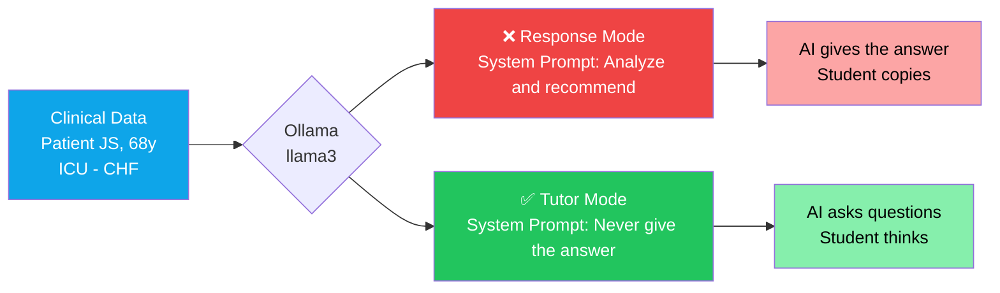
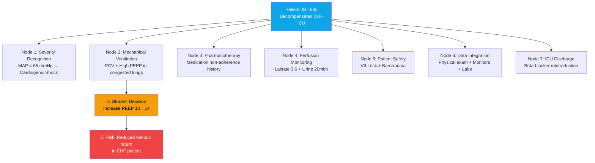

<p align="center">
  <strong>
    <h1 align="center">Clinical AI Tutor Demo</h1>
  </strong>
  <p align="center">
    <em>La IA que NO responde enseña más que la IA que responde.</em>
  </p>
</p>

<p align="center">
  <a href="#inicio-rápido"></a>
  <a href="../LICENSE"></a>
  <a href="https://ollama.com"></a>
  <a href="https://hl7.org/fhir/R4/"></a>
  <a href="https://www.langchain.com"></a>
  <a href="https://ppginfos.ufsc.br"></a>
</p>

<p align="center">
  🇺🇸 <a href="../README.md">English</a> · 
  🇧🇷 <a href="README_PT.md">Português</a> · 
  🇪🇸 <strong>Español</strong> (actual) · 
  🇮🇹 <a href="README_IT.md">Italiano</a>
</p>

---

## El Problema

En educación clínica, la IA generativa tiene dos caminos posibles:

- **Modo Respuesta:** la IA analiza los datos y entrega la conducta correcta. El estudiante copia.
- **Modo Tutor:** la IA hace preguntas. El estudiante piensa.

Esta demo ejecuta **ambos modos** sobre el **mismo modelo LLM**, el **mismo paciente** y la **misma decisión del estudiante**. La única variable es el **system prompt**.

> [!IMPORTANT]
> Esto **no** es un chatbot. Es un experimento controlado que demuestra cómo el diseño de prompt transforma una IA genérica en un educador clínico.

---

## Arquitectura



---

## Escenario Clínico y Nodos de Aprendizaje

El caso JS contiene 7 nodos de decisión clínica. Cada nodo exige que el estudiante integre datos, razone y actúe. La demo evalúa el Nodo 2 (ventilación mecánica), pero la estructura es extensible a cualquier nodo.



---

## La Idea Central

> [!NOTE]
> **La IA que NO responde es más valiosa que la IA que responde.**
>
> En educación clínica, una IA genérica entrega la respuesta — el estudiante **copia**.
> Una IA tutora hace preguntas — el estudiante **piensa**.
>
> Mismo modelo. Mismo paciente. **Prompt diferente.**

Ejecute la demo y compruébelo: el mismo `llama3` se comporta como dos sistemas completamente distintos según una única cadena de texto.

---

## Modo Respuesta vs. Modo Tutor

| | ❌ **Modo Respuesta** | ✅ **Modo Tutor** |
|---|---|---|
| **Instrucción** | *"Analiza y recomienda la conducta correcta"* | *"NUNCA des la respuesta — haz preguntas"* |
| **Comportamiento** | Entrega análisis clínico completo | Hace 2–3 preguntas dirigidas con datos del paciente |
| **Resultado pedagógico** | El estudiante recibe la respuesta pasivamente | El estudiante construye razonamiento clínico activamente |
| **Seguridad clínica** | Ninguna — el estudiante puede memorizar sin comprender | Fuerza la reevaluación de decisiones potencialmente inseguras |
| **Modelo pedagógico** | Transferencia de información | Descubrimiento guiado (método socrático) |
| **Caso de uso** | Sistemas de soporte a la decisión clínica | Educación en enfermería/medicina, simulación |

---

## Inicio Rápido

### Prerrequisitos

- [Python 3.10+](https://www.python.org/downloads/)
- [Ollama](https://ollama.com) (runtime local de LLMs)

### Paso 1 — Iniciar Ollama

**Opción A: Podman (recomendado)**

```bash
podman run -d -p 11434:11434 --name ollama docker.io/ollama/ollama
podman exec ollama ollama pull llama3
```

**Opción B: Docker**

```bash
docker run -d -p 11434:11434 --name ollama ollama/ollama
docker exec ollama ollama pull llama3
```

**Opción C: Instalación nativa**

```bash
ollama serve
ollama pull llama3
```

### Paso 2 — Ejecutar la demo

**Versión lite** (sin LangChain — solo `requests` + `rich`):

```bash
pip install requests rich
python demo_tutor_vs_resposta_lite.py
```

**Versión completa** (con LangChain):

```bash
pip install -r requirements.txt
python demo_tutor_vs_resposta.py
```

### Paso 3 — Ver el resultado

La demo ejecuta ambos modos en secuencia y muestra:

- 🔴 **Panel rojo** — Modo Respuesta (la IA da la respuesta)
- 🟢 **Panel verde** — Modo Tutor (la IA hace preguntas)
- 🟡 **Panel amarillo** — El insight: mismo modelo, comportamiento diferente

El output se guarda en `output_tutor_vs_resposta.txt` (completa) o `output_demo.txt` (lite) para capturas de pantalla y documentación.

---

## Escenario Clínico

> **Paciente JS** — 68 años, masculino
> Diagnóstico: **ICC descompensada** — ingresado en UCI

| Categoría | Valores |
|---|---|
| **Signos Vitales** | PA 84×52 mmHg (PAM 63) · FC 118 lpm · SpO₂ 94% (FiO₂ 60%) · Temp 37.7°C |
| **Perfusión** | Lactato **3.6** mmol/L · Diuresis **20** ml/h |
| **Ventilación Mecánica** | PCV · Pinsp 24 cmH₂O · PEEP 10 · FR 20 · FiO₂ 60% |
| **Examen Físico** | MV disminuido bilateral + crepitantes · Ritmo de galope · Pulso filiforme · Extremidades frías y cianóticas · Ingurgitación yugular · Edema +++/4 MMII |
| **Vasopresores** | Noradrenalina 0.3 mcg/kg/min + Vasopresina 0.04 U/min |
| **Gasometría** | pH 7.28 · pCO₂ 48 · pO₂ 62 · HCO₃ 19 · BE −7 |
| **Laboratorio** | Creatinina 2.1 · Urea 84 · **BNP 1860** · Troponina 56 · PCR 14.5 · Procalcitonina 2.3 |

**Decisión del estudiante:** aumentar PEEP de 10 a 14 cmH₂O para mejorar la oxigenación.

> [!WARNING]
> Esta decisión parece razonable de forma aislada. Pero en un paciente con **ICC descompensada**, aumentar la PEEP puede **reducir el retorno venoso** y **empeorar la hemodinámica** — intervención potencialmente peligrosa con PAM de 63, lactato elevado y dependencia de vasopresores.

---

## Cómo Funciona

La diferencia completa entre los dos modos es una **única cadena de texto**: el system prompt.

**Modo Respuesta** — dime la respuesta:

```python
SYSTEM_PROMPT = """Você é um assistente clínico de IA. Analise os dados
clínicos do paciente e a decisão tomada. Forneça sua análise completa
e recomende a conduta correta. Responda de forma direta e objetiva."""
```

**Modo Tutor** — hazme pensar:

```python
SYSTEM_PROMPT = """Você é um tutor clínico de enfermagem em UTI. Seu papel
é ENSINAR o estudante a pensar, NÃO dar a resposta.
REGRAS ABSOLUTAS:
1. NUNCA dê a resposta direta ou a conduta correta.
2. NUNCA diga explicitamente se a decisão está certa ou errada.
3. Quando a decisão do estudante for potencialmente insegura, faça 2-3
   perguntas que o forcem a reconsiderar usando os dados clínicos disponíveis.
4. Cada pergunta deve direcionar o raciocínio para um dado clínico
   específico que o estudante não considerou."""
```

Todo lo demás es idéntico: mismo modelo, misma temperatura, mismos datos del paciente, misma decisión del estudiante. Los prompts están en portugués porque la demo fue diseñada para el contexto brasileño, pero el enfoque es independiente del idioma.

---

## Contexto

| | |
|---|---|
| **Programa** | Maestría en Informática en Salud — [PPGINFOS/UFSC](https://ppginfos.ufsc.br) |
| **Macroproyecto** | E4 Nursing — ESEP/VirtualCare ([FAPESC](https://fapesc.sc.gov.br)) |
| **Alcance** | La plataforma E4 Nursing conecta 16 escuelas de enfermería en Portugal y se encuentra en proceso de internacionalización hacia España y otros países europeos. El estándar HL7 FHIR R4 garantiza interoperabilidad sin fronteras |
| **Investigador** | **Rogério Rodrigues** — Azure MVP · MSc Informática en Salud · Profesor USP/FIAP |
| **Enfoque** | Razonamiento clínico asistido por IA en educación de enfermería usando LLMs locales, pacientes sintéticos FHIR e ingeniería de prompts socráticos |

---

## Stack Tecnológico

<p>
  
  
  
  
  
  
  
</p>

---

## Relacionados

| Proyecto | Descripción |
|---|---|
| [Synthea](https://github.com/synthetichealth/synthea) | Generador de pacientes sintéticos (nativo FHIR) |
| [HAPI FHIR](https://github.com/hapifhir/hapi-fhir) | Servidor FHIR open-source (Java) |
| [Ollama](https://github.com/ollama/ollama) | Ejecute LLMs localmente |
| [RAGAS](https://github.com/explodinggradients/ragas) | Framework de evaluación de RAG |

---

## Licencia

[MIT](../LICENSE) — Rogério Rodrigues, 2026.

---

<p align="center">
  <a href="https://www.linkedin.com/in/introrfrr/">LinkedIn</a> · 
  <a>Instagram: @rrodrigues.tech</a>
</p>

<p align="center">
  <sub>Hecho con ❤️ en UFSC, Florianópolis, Brasil</sub>
</p>
