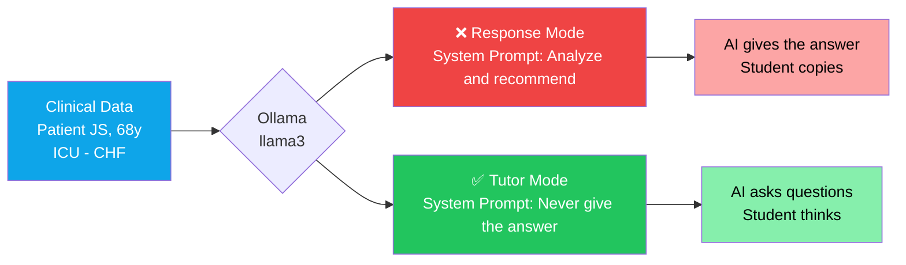
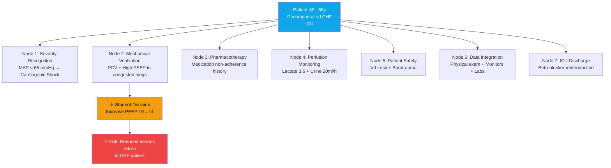

<p align="center">
  <strong>
    <h1 align="center">Clinical AI Tutor Demo</h1>
  </strong>
  <p align="center">
    <em>L'IA che NON risponde insegna più dell'IA che risponde.</em>
  </p>
</p>

<p align="center">
  <a href="#avvio-rapido"></a>
  <a href="../LICENSE"></a>
  <a href="https://ollama.com"></a>
  <a href="https://hl7.org/fhir/R4/"></a>
  <a href="https://www.langchain.com"></a>
  <a href="https://ppginfos.ufsc.br"></a>
</p>

<p align="center">
  🇺🇸 <a href="../README.md">English</a> · 
  🇧🇷 <a href="README_PT.md">Português</a> · 
  🇪🇸 <a href="README_ES.md">Español</a> · 
  🇮🇹 <strong>Italiano</strong> (corrente)
</p>

---

## Il Problema

Nell'educazione clinica, l'IA generativa ha due percorsi possibili:

- **Modalità Risposta:** l'IA analizza i dati e fornisce la condotta corretta. Lo studente copia.
- **Modalità Tutor:** l'IA pone domande. Lo studente ragiona.

Questa demo esegue **entrambe le modalità** sullo **stesso modello LLM**, lo **stesso paziente** e la **stessa decisione dello studente**. L'unica variabile è il **system prompt**.

> [!IMPORTANT]
> Questo **non** è un chatbot. È un esperimento controllato che dimostra come il design del prompt trasforma un'IA generica in un educatore clinico.

---

## Architettura



---

## Scenario Clinico e Nodi di Apprendimento

Il caso JS contiene 7 nodi di decisione clinica. Ogni nodo richiede allo studente di integrare dati, ragionare e agire. La demo valuta il Nodo 2 (ventilazione meccanica), ma la struttura è estensibile a qualsiasi nodo.



---

## L'Idea Centrale

> [!NOTE]
> **L'IA che NON risponde è più preziosa dell'IA che risponde.**
>
> Nell'educazione clinica, un'IA generica fornisce la risposta — lo studente **copia**.
> Un'IA tutor pone domande — lo studente **ragiona**.
>
> Stesso modello. Stesso paziente. **Prompt diverso.**

Eseguite la demo e verificate: lo stesso `llama3` si comporta come due sistemi completamente diversi in base a un'unica stringa di testo.

---

## Modalità Risposta vs. Modalità Tutor

| | ❌ **Modalità Risposta** | ✅ **Modalità Tutor** |
|---|---|---|
| **Istruzione** | *"Analizza e raccomanda la condotta corretta"* | *"MAI dare la risposta — poni domande"* |
| **Comportamento** | Fornisce un'analisi clinica completa | Pone 2–3 domande mirate con i dati del paziente |
| **Risultato pedagogico** | Lo studente riceve la risposta passivamente | Lo studente costruisce il ragionamento clinico attivamente |
| **Sicurezza clinica** | Nessuna — lo studente può memorizzare senza comprendere | Forza la rivalutazione di decisioni potenzialmente insicure |
| **Modello pedagogico** | Trasferimento di informazioni | Scoperta guidata (metodo socratico) |
| **Caso d'uso** | Sistemi di supporto alla decisione clinica | Formazione infermieristica/medica, simulazione |

---

## Avvio Rapido

### Prerequisiti

- [Python 3.10+](https://www.python.org/downloads/)
- [Ollama](https://ollama.com) (runtime locale per LLM)

### Passo 1 — Avviare Ollama

**Opzione A: Podman (consigliato)**

```bash
podman run -d -p 11434:11434 --name ollama docker.io/ollama/ollama
podman exec ollama ollama pull llama3
```

**Opzione B: Docker**

```bash
docker run -d -p 11434:11434 --name ollama ollama/ollama
docker exec ollama ollama pull llama3
```

**Opzione C: Installazione nativa**

```bash
ollama serve
ollama pull llama3
```

### Passo 2 — Eseguire la demo

**Versione lite** (senza LangChain — solo `requests` + `rich`):

```bash
pip install requests rich
python demo_tutor_vs_resposta_lite.py
```

**Versione completa** (con LangChain):

```bash
pip install -r requirements.txt
python demo_tutor_vs_resposta.py
```

### Passo 3 — Visualizzare il risultato

La demo esegue entrambe le modalità in sequenza e visualizza:

- 🔴 **Pannello rosso** — Modalità Risposta (l'IA fornisce la risposta)
- 🟢 **Pannello verde** — Modalità Tutor (l'IA pone domande)
- 🟡 **Pannello giallo** — L'insight: stesso modello, comportamento diverso

L'output viene salvato in `output_tutor_vs_resposta.txt` (completa) o `output_demo.txt` (lite) per screenshot e documentazione.

---

## Scenario Clinico

> **Paziente JS** — 68 anni, maschio
> Diagnosi: **Scompenso cardiaco congestizio** — ricoverato in Terapia Intensiva

| Categoria | Valori |
|---|---|
| **Segni Vitali** | PA 84×52 mmHg (PAM 63) · FC 118 bpm · SpO₂ 94% (FiO₂ 60%) · Temp 37.7°C |
| **Perfusione** | Lattato **3.6** mmol/L · Diuresi **20** ml/h |
| **Ventilazione Meccanica** | PCV · Pinsp 24 cmH₂O · PEEP 10 · FR 20 · FiO₂ 60% |
| **Esame Obiettivo** | MV ridotto bilaterale + crepitii · Ritmo di galoppo · Polso filiforme · Estremità fredde e cianotiche · Turgore giugulare · Edema +++/4 AAII |
| **Vasopressori** | Noradrenalina 0.3 mcg/kg/min + Vasopressina 0.04 U/min |
| **Emogasanalisi** | pH 7.28 · pCO₂ 48 · pO₂ 62 · HCO₃ 19 · BE −7 |
| **Laboratorio** | Creatinina 2.1 · Urea 84 · **BNP 1860** · Troponina 56 · PCR 14.5 · Procalcitonina 2.3 |

**Decisione dello studente:** aumentare la PEEP da 10 a 14 cmH₂O per migliorare l'ossigenazione.

> [!WARNING]
> Questa decisione sembra ragionevole isolatamente. Ma in un paziente con **scompenso cardiaco**, aumentare la PEEP può **ridurre il ritorno venoso** e **peggiorare l'emodinamica** — un intervento potenzialmente pericoloso con PAM 63, lattato elevato e dipendenza da vasopressori.

---

## Come Funziona

L'intera differenza tra le due modalità è una **singola stringa**: il system prompt.

**Modalità Risposta** — dimmi la risposta:

```python
SYSTEM_PROMPT = """Você é um assistente clínico de IA. Analise os dados
clínicos do paciente e a decisão tomada. Forneça sua análise completa
e recomende a conduta correta. Responda de forma direta e objetiva."""
```

**Modalità Tutor** — fammi pensare:

```python
SYSTEM_PROMPT = """Você é um tutor clínico de enfermagem em UTI. Seu papel
é ENSINAR o estudante a pensar, NÃO dar a resposta.
REGRAS ABSOLUTAS:
1. NUNCA dê a resposta direta ou a conduta correta.
2. NUNCA diga explicitamente se a decisão está certa ou errada.
3. Quando a decisão do estudante for potencialmente insegura, faça 2-3
   perguntas que o forcem a reconsiderar usando os dados clínicos disponíveis.
4. Cada pergunta deve direcionar o raciocínio para um dado clínico
   específico que o estudante não considerou."""
```

Tutto il resto è identico: stesso modello, stessa temperatura, stessi dati del paziente, stessa decisione dello studente. I prompt sono in portoghese perché la demo è stata progettata per il contesto brasiliano, ma l'approccio è indipendente dalla lingua.

---

## Contesto

| | |
|---|---|
| **Programma** | Master in Informatica Sanitaria — [PPGINFOS/UFSC](https://ppginfos.ufsc.br) |
| **Macroprogetto** | E4 Nursing — ESEP/VirtualCare ([FAPESC](https://fapesc.sc.gov.br)) |
| **Portata** | La piattaforma E4 Nursing collega 16 scuole infermieristiche in Portogallo ed è in fase di internazionalizzazione verso l'Italia e altri paesi europei. L'Italia ha una solida tradizione nell'informatica sanitaria e nella formazione infermieristica avanzata. Lo standard HL7 FHIR R4, già adottato in numerosi ospedali italiani, garantisce interoperabilità senza confini |
| **Ricercatore** | **Rogério Rodrigues** — Azure MVP · MSc Informatica Sanitaria · Professore USP/FIAP |
| **Focus** | Ragionamento clinico assistito da IA nella formazione infermieristica tramite LLM locali, pazienti sintetici FHIR e prompt engineering socratico |

---

## Stack Tecnologico

<p>
  
  
  
  
  
  
  
</p>

---

## Correlati

| Progetto | Descrizione |
|---|---|
| [Synthea](https://github.com/synthetichealth/synthea) | Generatore di pazienti sintetici (nativo FHIR) |
| [HAPI FHIR](https://github.com/hapifhir/hapi-fhir) | Server FHIR open-source (Java) |
| [Ollama](https://github.com/ollama/ollama) | Eseguire LLM localmente |
| [RAGAS](https://github.com/explodinggradients/ragas) | Framework di valutazione RAG |

---

## Licenza

[MIT](../LICENSE) — Rogério Rodrigues, 2026.

---

<p align="center">
  <a href="https://www.linkedin.com/in/introrfrr/">LinkedIn</a> · 
  <a>Instagram: @rrodrigues.tech</a>
</p>

<p align="center">
  <sub>Fatto con ❤️ presso UFSC, Florianópolis, Brasile</sub>
</p>
