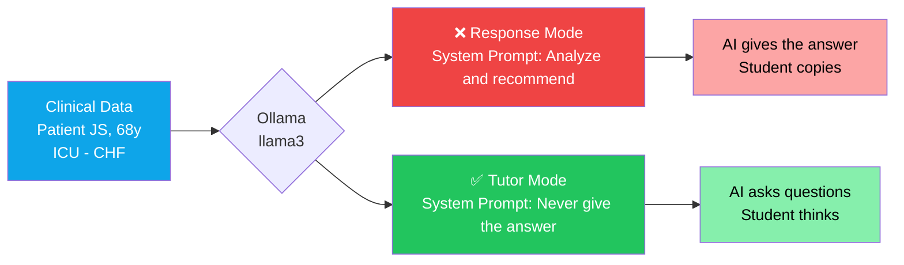
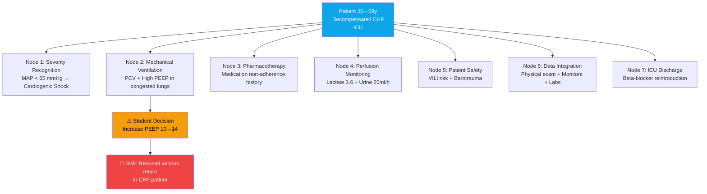

<p align="center">
  <strong>
    <h1 align="center">Clinical AI Tutor Demo</h1>
  </strong>
  <p align="center">
    <em>A IA que NÃO responde ensina mais do que a IA que responde.</em>
  </p>
</p>

<p align="center">
  <a href="#como-rodar"></a>
  <a href="../LICENSE"></a>
  <a href="https://ollama.com"></a>
  <a href="https://hl7.org/fhir/R4/"></a>
  <a href="https://www.langchain.com"></a>
  <a href="https://ppginfos.ufsc.br"></a>
</p>

<p align="center">
  🇺🇸 <a href="../README.md">English</a> · 
  🇧🇷 <strong>Português</strong> (atual) · 
  🇪🇸 <a href="README_ES.md">Español</a> · 
  🇮🇹 <a href="README_IT.md">Italiano</a>
</p>

---

## O Que É Isso?

Uma demonstração que expõe a **diferença fundamental** entre dois modos de IA na educação clínica. Mesmo modelo. Mesmo paciente. Mesma decisão do estudante. A única variável é o **system prompt**.

Modo Resposta: a IA analisa e entrega a conduta. O estudante copia.
Modo Tutor: a IA faz perguntas. O estudante pensa.

> [!IMPORTANT]
> Isso **não** é um chatbot. É um experimento controlado que mostra como o design de prompt transforma uma IA genérica em educador clínico.

---

## Arquitetura



---

## Cenário Clínico e Nós de Aprendizagem

O caso JS tem 7 nós de decisão clínica — pontos onde o estudante precisa integrar dados, raciocinar e agir. A demo testa o Nó 2 (ventilação mecânica), mas a estrutura serve para qualquer nó.



---

## O Insight Central

> [!NOTE]
> **A IA que NÃO responde é mais valiosa que a IA que responde.**
>
> Na educação clínica, uma IA genérica entrega a resposta — o estudante **copia**.
> Uma IA tutora faz perguntas — o estudante **pensa**.
>
> Mesmo modelo. Mesmo paciente. **Prompt diferente.**

Isso não é teoria. Rode a demo e veja: o mesmo `llama3` se comporta como dois sistemas completamente diferentes dependendo de uma única string.

---

## Modo Resposta vs. Modo Tutor

| | ❌ **Modo Resposta** | ✅ **Modo Tutor** |
|---|---|---|
| **Instrução** | *"Analise e recomende a conduta correta"* | *"NUNCA dê a resposta — faça perguntas"* |
| **Comportamento** | Entrega análise clínica completa | Faz 2–3 perguntas direcionadas com dados do paciente |
| **Resultado pedagógico** | Estudante recebe a resposta passivamente | Estudante constrói raciocínio clínico ativamente |
| **Segurança clínica** | Nenhuma — estudante pode memorizar sem entender | Força reavaliação de decisões potencialmente inseguras |
| **Modelo pedagógico** | Transferência de informação | Descoberta guiada (método socrático) |
| **Caso de uso** | Sistemas de suporte à decisão clínica | Educação em enfermagem/medicina, simulação |

---

## Como Rodar

### Pré-requisitos

- [Python 3.10+](https://www.python.org/downloads/)
- [Ollama](https://ollama.com) (runtime local de LLMs)

### Passo 1 — Subir o Ollama

**Opção A: Podman (recomendado)**

```bash
podman run -d -p 11434:11434 --name ollama docker.io/ollama/ollama
podman exec ollama ollama pull llama3
```

**Opção B: Docker**

```bash
docker run -d -p 11434:11434 --name ollama ollama/ollama
docker exec ollama ollama pull llama3
```

**Opção C: Instalação nativa**

```bash
ollama serve
ollama pull llama3
```

### Passo 2 — Rodar a demo

**Versão lite** (sem LangChain — só `requests` + `rich`):

```bash
pip install requests rich
python demo_tutor_vs_resposta_lite.py
```

**Versão completa** (com LangChain):

```bash
pip install -r requirements.txt
python demo_tutor_vs_resposta.py
```

### Passo 3 — Ver o resultado

A demo executa os dois modos em sequência e exibe:

- 🔴 **Painel vermelho** — Modo Resposta (a IA dá a resposta)
- 🟢 **Painel verde** — Modo Tutor (a IA faz perguntas)
- 🟡 **Painel amarelo** — O insight: mesmo modelo, comportamento diferente

O output é salvo em `output_tutor_vs_resposta.txt` (completa) ou `output_demo.txt` (lite) para screenshots e documentação.

---

## Cenário Clínico

> **Paciente JS** — 68 anos, masculino
> Diagnóstico: **ICC descompensada** — internado em UTI

| Categoria | Valores |
|---|---|
| **Sinais Vitais** | PA 84×52 mmHg (PAM 63) · FC 118 bpm · SatO₂ 94% (FiO₂ 60%) · Temp 37.7°C |
| **Perfusão** | Lactato **3.6** mmol/L · Débito urinário **20** ml/h |
| **Ventilação Mecânica** | PCV · Pinsp 24 cmH₂O · PEEP 10 · FR 20 · FiO₂ 60% |
| **Exame Físico** | MV reduzido bilateral + estertores · Ritmo de galope · Pulso filiforme · Extremidades frias e cianóticas · Jugulares distendidas · Edema +++/4 MMII |
| **Drogas Vasoativas** | Noradrenalina 0.3 mcg/kg/min + Vasopressina 0.04 U/min |
| **Gasometria** | pH 7.28 · pCO₂ 48 · pO₂ 62 · HCO₃ 19 · BE −7 |
| **Laboratório** | Creatinina 2.1 · Ureia 84 · **BNP 1860** · Troponina 56 · PCR 14.5 · Procalcitonina 2.3 |

**Decisão do estudante:** aumentar PEEP de 10 para 14 cmH₂O para melhorar oxigenação.

> [!WARNING]
> Essa decisão parece razoável isoladamente. Mas em um paciente com **ICC descompensada**, aumentar PEEP pode **reduzir o retorno venoso** e **piorar a hemodinâmica** — intervenção potencialmente perigosa com PAM de 63, lactato elevado e dependência de vasopressores.

---

## Como Funciona

A diferença inteira entre os dois modos é uma **única string**: o system prompt.

**Modo Resposta** — me diga a resposta:

```python
SYSTEM_PROMPT = """Você é um assistente clínico de IA. Analise os dados
clínicos do paciente e a decisão tomada. Forneça sua análise completa
e recomende a conduta correta. Responda de forma direta e objetiva."""
```

**Modo Tutor** — me faça pensar:

```python
SYSTEM_PROMPT = """Você é um tutor clínico de enfermagem em UTI. Seu papel
é ENSINAR o estudante a pensar, NÃO dar a resposta.
REGRAS ABSOLUTAS:
1. NUNCA dê a resposta direta ou a conduta correta.
2. NUNCA diga explicitamente se a decisão está certa ou errada.
3. Quando a decisão do estudante for potencialmente insegura, faça 2-3
   perguntas que o forcem a reconsiderar usando os dados clínicos disponíveis.
4. Cada pergunta deve direcionar o raciocínio para um dado clínico
   específico que o estudante não considerou."""
```

Todo o resto é idêntico: mesmo modelo, mesma temperatura, mesmos dados do paciente, mesma decisão do estudante.

---

## Por Que Isso Importa

O mercado global de simulação clínica deve atingir **USD 3–7 bilhões até 2027**. As plataformas líderes (CAE Healthcare, Laerdal, Shadow Health) são proprietárias, caras e desenhadas para o contexto norte-americano e europeu.

Três problemas concretos:

1. **Não usam FHIR.** Os pacientes simulados vivem em silos proprietários. Não interoperam com prontuários eletrônicos, nem entre si.
2. **Não interoperam com o SUS.** Nenhuma dessas plataformas conversa com a RNDS, e-SUS ou os padrões brasileiros de saúde digital.
3. **Custo proibitivo.** Licenças anuais por aluno inviabilizam adoção em escala no ensino público brasileiro.

Esta demo mostra que um **pipeline 100% open-source** — Synthea (paciente FHIR) + Ollama (LLM local) + prompt design — reproduz o comportamento pedagógico de um tutor socrático **sem licença de software, sem nuvem, sem custo por aluno**.

Isso não substitui simuladores de alta fidelidade. Mas cobre a lacuna onde **90% dos estudantes brasileiros** estão: sem acesso a nenhuma simulação com IA.

---

## Contexto

| | |
|---|---|
| **Programa** | Mestrado em Informática em Saúde — [PPGINFOS/UFSC](https://ppginfos.ufsc.br) |
| **Macroprojeto** | E4 Nursing — ESEP/VirtualCare ([FAPESC](https://fapesc.sc.gov.br)) |
| **Escopo** | Plataforma E4 Nursing conecta 16 escolas de enfermagem em Portugal (ESEP/VirtualCare); este trabalho adapta a abordagem ao contexto brasileiro |
| **Pesquisador** | **Rogério Rodrigues** — Azure MVP · MSc Informática em Saúde · Professor USP/FIAP |
| **Foco** | Raciocínio clínico assistido por IA na educação em enfermagem usando LLMs locais, pacientes sintéticos FHIR e engenharia de prompts socráticos |

---

## Stack Tecnológico

<p>
  
  
  
  
  
  
  
</p>

---

## Relacionados

| Projeto | Descrição |
|---|---|
| [Synthea](https://github.com/synthetichealth/synthea) | Gerador de pacientes sintéticos (nativo FHIR) |
| [HAPI FHIR](https://github.com/hapifhir/hapi-fhir) | Servidor FHIR open-source (Java) |
| [Ollama](https://github.com/ollama/ollama) | Execute LLMs localmente |
| [RAGAS](https://github.com/explodinggradients/ragas) | Framework de avaliação de RAG |

---

## Licença

[MIT](../LICENSE) — Rogério Rodrigues, 2026.

---

<p align="center">
  <a href="https://www.linkedin.com/in/introrfrr/">LinkedIn</a> · 
  <a>Instagram: @rrodrigues.tech</a>
</p>

<p align="center">
  <sub>Feito com ❤️ na UFSC, Florianópolis, Brasil</sub>
</p>
