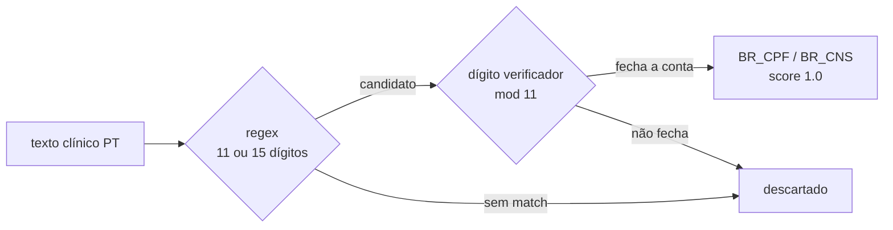

<div align="center">

# 🛡️ Presidio + reconhecedores BR (CPF e CNS)

### _The regex finds the candidate. The check digit decides if it is PII._

<br>

[](https://github.com/data-privacy-stack/presidio)
[](https://spacy.io/models/pt)
[](https://python.org)
[](../../LICENSE)

<br>

**Brazilian CPF and CNS recognizers for Microsoft Presidio, measured on a synthetic Portuguese clinical corpus: recall 0/100 → 100/100, and the check digit is what keeps false positives at zero.**

**Reconhecedores de CPF e CNS pro Microsoft Presidio, medidos num corpus clínico sintético em português: recall 0/100 → 100/100, e é o dígito verificador que segura o falso positivo em zero.**

<br>

[🇬🇧 English](docs/README.en.md) · [🇧🇷 Português](docs/README.pt.md) · [🇪🇸 Español](docs/README.es.md) · [🇮🇹 Italiano](docs/README.it.md)

</div>

---

## 🇬🇧 What it does

[Presidio](https://github.com/data-privacy-stack/presidio) ships country-specific recognizers for 18 countries. None for Brazil. Run it on a Portuguese clinical note and the CPF walks straight through the anonymizer:

```
<PERSON>, CPF 158.813.998-03, admitida na enfermaria com dispneia aos esforços.
```

This demo adds two recognizers, `BR_CPF` and `BR_CNS`, built the same way Presidio builds its own (`PatternRecognizer` + `validate_result()`), and measures them on 300 synthetic texts:

| Measure | Presidio default | + BR regex only | + BR with check digit |
|---------|-----------------:|----------------:|----------------------:|
| Recall BR_CPF (100 valid CPFs) | 0/100 | — | 100/100 |
| Recall BR_CNS (100 valid CNSs) | 0/100 | — | 100/100 |
| False positives BR_CPF (100 non-CPF 11-digit numbers) | — | 100/100 | 0/100 |

Default Presidio labelled 17 of the 200 CPF/CNS numbers as `PHONE_NUMBER`. The other 183 went untouched.

## 🇧🇷 O que faz

O [Presidio](https://github.com/data-privacy-stack/presidio) traz reconhecedores específicos pra 18 países. Nenhum pro Brasil. Roda ele numa evolução em português e o CPF passa inteiro pelo anonimizador:

```
<PERSON>, CPF 158.813.998-03, admitida na enfermaria com dispneia aos esforços.
```

Esta demo adiciona dois reconhecedores, `BR_CPF` e `BR_CNS`, no mesmo desenho dos reconhecedores nativos do Presidio (`PatternRecognizer` + `validate_result()`), e mede os dois em 300 textos sintéticos (tabela acima).

O Presidio padrão rotulou 17 dos 200 CPF/CNS como `PHONE_NUMBER`. Os outros 183 passaram em branco.

---

## 🧠 The design choice / A escolha de design



Regex alone flags every 11-digit number as a CPF: order numbers, invoices, lot numbers, mistyped CPFs. `validate_result()` runs the mod-11 check digit on each candidate and drops what fails. That is why the false-positive column goes from 100 to 0 without touching recall.

Só regex marca todo número de 11 dígitos como CPF: pedido, nota fiscal, lote, CPF digitado errado. O `validate_result()` roda o dígito verificador mod 11 em cada candidato e descarta o que não fecha. É por isso que a coluna de falso positivo vai de 100 pra 0 sem mexer no recall.

---

## ⚡ Quickstart

```bash
cd demos/04-presidio-br
pip install -r requirements.txt
python3 -m spacy download pt_core_news_sm

python3 demo_presidio_br.py     # roda a medição e escreve output_presidio_br.txt
python3 -m pytest tests/        # 13 testes: validadores + reconhecedores
```

No FHIR server or Ollama needed for this one. Everything runs offline on the CPU.

Não precisa de servidor FHIR nem de Ollama nesta demo. Tudo roda offline, na CPU.

### Use in your own pipeline / Usar no seu pipeline

```python
from presidio_analyzer import AnalyzerEngine
from presidio_br import registrar_reconhecedores_br

analyzer = AnalyzerEngine(supported_languages=["pt"], nlp_engine=...)  # spaCy pt
registrar_reconhecedores_br(analyzer)

analyzer.analyze(text="Paciente Ana L., CPF 158.813.998-03", language="pt")
# → [type: BR_CPF, start: 21, end: 35, score: 1.0]
```

---

## ⚠️ Limits / Limites

- Synthetic, clean corpus (seed fixed). No OCR noise, no line breaks inside the number, no real records.
- CPF spelled out in words ("cento e cinquenta e oito...") is out of scope.
- CRM (medical license) is not covered yet.
- spaCy's `pt_core_news_sm` tags "cartão SUS" as `ORGANIZATION` in some sentences. Harmless for anonymization, noisy for metrics.

<br>

- Corpus sintético e limpo (seed fixa). Sem ruído de OCR, sem quebra de linha dentro do número, sem dado real.
- CPF por extenso fica de fora.
- CRM ainda não entra.
- O `pt_core_news_sm` marca "cartão SUS" como `ORGANIZATION` em algumas frases. Inofensivo pra anonimizar, ruidoso pra métrica.

---

## 🗺️ Next / Próximos passos

- [ ] Upstream PR to [`data-privacy-stack/presidio`](https://github.com/data-privacy-stack/presidio) as `country_specific/brazil` (country 19, first in Latin America)
- [ ] CRM recognizer with state suffix (CRM/SC 12345)
- [ ] Measure on dirty synthetic text (OCR, line breaks, spelled-out digits)
- [ ] Wire into the NursIA pipeline before any real record enters it

---

## 📚 How to cite / Como citar

> Rodrigues, R. (2026). *presidio-br: Brazilian CPF and CNS recognizers for Microsoft Presidio* (demo 04, NursIA Research Lab). PPGINFOS/UFSC. https://github.com/rogeriorrodrigues/nursia-research-lab/tree/main/demos/04-presidio-br

---

## 🏥 Connection to the NursIA project / Conexão com o projeto NursIA

Part of the **NursIA Research Lab**, master's research at PPGINFOS/UFSC with a FAPESC scholarship. Presidio is the pre-LLM anonymization layer planned for NursIA the day real records enter the pipeline ([roadmap](../../roadmap.md)). The other demos:

Parte do **NursIA Research Lab**, pesquisa de mestrado no PPGINFOS/UFSC com bolsa FAPESC. O Presidio é a camada de anonimização pré-LLM prevista pro NursIA no dia em que dado real entrar no pipeline ([roadmap](../../roadmap.md)). As outras demos:

- [`demos/01-fhir-ollama-local`](../01-fhir-ollama-local/) — full local pipeline · pipeline local completo.
- [`demos/02-clinical-ai-tutor`](../02-clinical-ai-tutor/) — Response Mode vs. Tutor Mode · Modo Resposta vs. Modo Tutor.
- [`demos/03-everything-fhir`](../03-everything-fhir/) — `$everything` FHIR → LLM context.

---

## 📜 License

[MIT](../../LICENSE) — Rogério Rodrigues, 2026.
