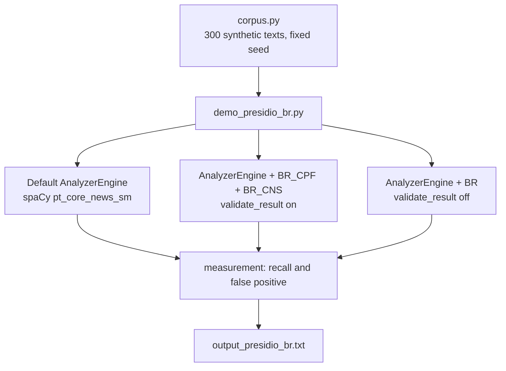

<div align="center">

# 🛡️ Presidio + Brazilian recognizers — Full documentation in EN

[← Back to the demo README](../README.md) · [🇧🇷 Português](README.pt.md) · [🇪🇸 Español](README.es.md) · [🇮🇹 Italiano](README.it.md)

</div>

---

## 📋 Table of contents

- [The problem](#-the-problem)
- [Architecture](#-architecture)
- [Prerequisites](#-prerequisites)
- [Step by step](#-step-by-step)
- [Code walkthrough](#-code-walkthrough)
- [Expected output](#-expected-output)
- [Why the check digit lives in the recognizer](#-why-the-check-digit-lives-in-the-recognizer)
- [Limits](#-limits)
- [Troubleshooting](#-troubleshooting)
- [Next steps](#-next-steps)

---

## 🔎 The problem

[Microsoft Presidio](https://github.com/data-privacy-stack/presidio) is the most widely used open-source SDK for detecting and anonymizing PII in text before sending it to an LLM. It ships country-specific recognizers for 18 countries (Italy, Spain, India, Poland, Australia...). None for Brazil, none for Latin America.

In practice: you build the pipeline, run a nursing note in Portuguese through the anonymizer, and the CPF (CPF = Brazilian individual taxpayer ID) comes out intact on the other side. The name becomes `<PERSON>` because spaCy knows names. CPF is not an entity Presidio knows about, so there's nothing to flag.

Worse: when the number has 11 digits with no punctuation, the phone recognizer (which runs with the BR region enabled by default) sometimes catches it. In this measurement, 17 of 200 CPF/CNS (CNS = National Health Card) numbers became `PHONE_NUMBER`. It anonymizes, but with the wrong label, and you can't trust the output.

---

## 🏗️ Architecture



Three engines, same corpus. The difference between A2 and A3 is one line: `validate_result()` returns `None` (keeps the regex score) or `True`/`False` (score 1.0 or discard).

---

## ⚙️ Prerequisites

- Python 3.10+
- Presidio 2.2.364 (pinned in `requirements.txt`; the July/2026 release)
- spaCy model `pt_core_news_sm`

No FHIR, no Ollama. This demo runs on its own, on CPU, in about 20 seconds.

---

## 🚀 Step by step

```bash
cd demos/04-presidio-br
pip install -r requirements.txt
python3 -m spacy download pt_core_news_sm

# 1. Run the measurement
python3 demo_presidio_br.py

# 2. Run the tests
python3 -m pytest tests/
```

The script prints the scene (text before and after the anonymizer, with and without the recognizers), the results table, and what the default Presidio called the number when it got it wrong. It also writes `output_presidio_br.txt` (git-ignored).

---

## 🧭 Code walkthrough

### `presidio_br/validators.py`

Just arithmetic, no dependency on Presidio.

`validar_cpf()` computes the two check digits with the mod-11 rule and rejects repeated sequences (`111.111.111-11` passes the math, but the Receita Federal never issues it).

`validar_cns()` handles the two types of CNS (National Health Card): the permanent one (starts with 1 or 2, derived from PIS — PIS is the worker registration number — the first 11 digits generate the final 4) and the provisional one (starts with 7, 8, or 9, a weighted sum with weights 15..1 must be a multiple of 11).

### `presidio_br/recognizers.py`

`BrCpfRecognizer` and `BrCnsRecognizer` inherit from `PatternRecognizer`, same as the built-in recognizers (`ItFiscalCodeRecognizer`, `EsNifRecognizer`). Each one has:

- two `Pattern` objects (with and without punctuation), with a deliberately low score;
- a `CONTEXT` list ("cpf", "cartão sus"...) that Presidio uses to raise the score when the word appears nearby;
- `validate_result()`, which runs the validator and returns `True`, `False`, or `None`.

The `validar=False` parameter exists only for the demo: it turns off the check digit and shows what happens.

### `corpus.py`

Generates 100 sentences with a valid CPF, 100 with a valid CNS, and 100 with an 11-digit number that is **not** a CPF (protocol number, invoice, batch, mistyped CPF). All built by construction with `random.Random(2026)`: no number belongs to a real person. Half the CPFs come out punctuated, half the CNSs come out with spaces, to cover both regexes.

### `demo_presidio_br.py`

Builds the `AnalyzerEngine` in Portuguese (without `NlpEngineProvider` set to `pt_core_news_sm`, Presidio won't even load the language), measures recall per slice, and counts false positives on the distractors. The measurement only looks at the number's span: if the right entity covers the number, it's a hit; everything else becomes "what Presidio called it."

---

## 📤 Expected output

```
texto de entrada
  Paciente Eduardo O., CPF 158.813.998-03, admitida na enfermaria com dispneia aos esforços.
depois do anonimizador
  <PERSON>, CPF 158.813.998-03, admitida na enfermaria com dispneia aos esforços.

mesmo texto, depois do anonimizador (com BR_CPF + BR_CNS)
  <PERSON>, CPF <BR_CPF>, admitida na enfermaria com dispneia aos esforços.

┃ Medida                                  ┃ Presidio padrão ┃ + BR só regex ┃ + BR com DV ┃
│ Recall BR_CPF (100 CPFs válidos)        │           0/100 │             — │     100/100 │
│ Recall BR_CNS (100 CNSs válidos)        │           0/100 │             — │     100/100 │
│ Falso positivo BR_CPF (100 distratores) │               — │       100/100 │       0/100 │

O que o Presidio padrão chamou o CPF/CNS quando não achou:
  PHONE_NUMBER: 17 de 200
  PERSON: 1 de 200
```

---

## 🧮 Why the check digit lives in the recognizer

The temptation is to solve it with a regex and call it done: `\d{3}\.\d{3}\.\d{3}-\d{2}` finds a punctuated CPF, `\d{11}` finds the rest. Works on paper. In production, every 11-digit number in the hospital becomes a CPF: order number, serum batch, work order. The "+ BR regex only" column shows it: 100 of 100 distractors flagged.

Presidio already has the right hook for this. In `PatternRecognizer`, after each match, it calls `validate_result(matched_text)`:

- `True` → score goes to 1.0
- `False` → result discarded
- `None` → keeps the regex score

That's exactly what the Italian fiscal code and Spanish NIF recognizers do. CPF has had a mod-11 check digit forever; so has CNS. Just use it. This drops the false-positive column to 0 without touching recall.

One practical consequence: the 1.0 score makes `BR_CPF` win over `PHONE_NUMBER` when both cover the same span. The anonymizer picks the higher score, and the text comes out with `<BR_CPF>`, not `<PHONE_NUMBER>`.

---

## ⚠️ Limits

- **Synthetic, clean corpus.** No OCR, no line breaks in the middle of a number, no real data. The 100/100 doesn't generalize to a real medical record; it's the ceiling of what the recognizer does when the number is well formed.
- **Spelled-out CPF** ("one hundred fifty-eight million...") is out of scope.
- **CRM** (physician license number) is not in yet.
- `pt_core_news_sm` tags "cartão SUS" as `ORGANIZATION` in some sentences. It doesn't hurt anonymization; it does add noise if you're measuring NER.
- `PhoneRecognizer` still flags the same 17 numbers as phone. `BR_CPF` wins on score, but the duplicate result still shows up in the analyzer's list.

---

## 🔧 Troubleshooting

**`OSError: [E050] Can't find model 'pt_core_news_sm'`**
Run `python3 -m spacy download pt_core_news_sm`.

**`ValueError: No matching recognizers were found for the specified language: pt`**
You forgot to pass `supported_languages=["pt"]` to `AnalyzerEngine`. See `criar_analyzer()`.

**Recall below 100 on your own text**
Check whether the number actually satisfies the check-digit math. Sample CPFs from websites are usually invalid on purpose.

---

## 🔮 Next steps

- Upstream PR to [`data-privacy-stack/presidio`](https://github.com/data-privacy-stack/presidio) as `country_specific/brazil` (country 19, the first from Latin America). The project moved from Microsoft to community governance in June/2026, and the technical committee is opening up to outside contributions.
- CRM recognizer with state (UF) code.
- Measurement on dirty synthetic text (OCR, line breaks, spelled-out digits).
- Wiring into the NursIA pipeline before any real data goes in.
