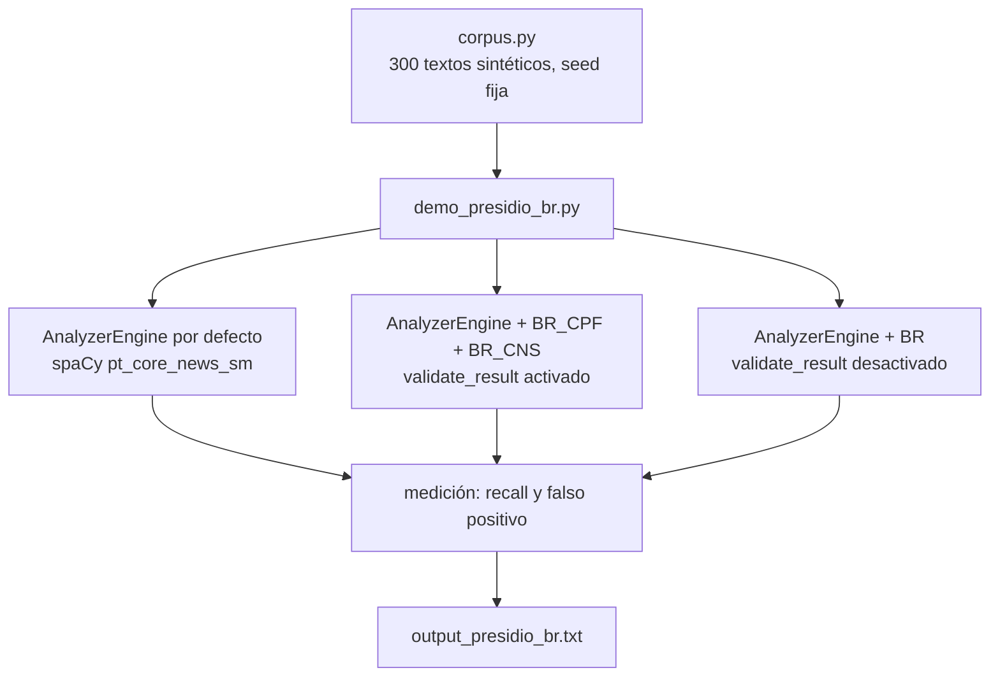

<div align="center">

# 🛡️ Presidio + reconocedores BR — Documentación completa en EN

[← Volver al README de la demo](../README.md) · [🇬🇧 English](README.en.md) · [🇧🇷 Português](README.pt.md) · [🇮🇹 Italiano](README.it.md)

</div>

---

## 📋 Índice

- [El problema](#-el-problema)
- [Arquitectura](#-arquitectura)
- [Prerrequisitos](#-prerrequisitos)
- [Paso a paso](#-paso-a-paso)
- [Recorrido por el código](#-recorrido-por-el-codigo)
- [Salida esperada](#-salida-esperada)
- [Por qué el dígito verificador vive en el reconocedor](#-por-que-el-digito-verificador-vive-en-el-reconocedor)
- [Límites](#-limites)
- [Solución de problemas](#-solucion-de-problemas)
- [Próximos pasos](#-proximos-pasos)

---

## 🔎 El problema

[Microsoft Presidio](https://github.com/data-privacy-stack/presidio) es el SDK open-source más usado para detectar y anonimizar PII en texto antes de enviarlo a un LLM. Trae reconocedores específicos de país para 18 países (Italia, España, India, Polonia, Australia...). Ninguno para Brasil, ninguno para América Latina.

En la práctica: armas el pipeline, pasas una nota de enfermería en portugués por el anonimizador, y el CPF (CPF = documento de identificación fiscal individual brasileño) sale entero del otro lado. El nombre se convierte en `<PERSON>` porque spaCy conoce nombres. El CPF no es una entidad que Presidio conozca, así que no hay nada que marcar.

Peor: cuando el número tiene 11 dígitos sin puntuación, el reconocedor de teléfono (que corre con la región BR activada por defecto) a veces lo captura. En esta medición, 17 de 200 CPF/CNS (CNS = Tarjeta Nacional de Salud) terminaron como `PHONE_NUMBER`. Anonimiza, pero con la etiqueta equivocada, y no puedes confiar en lo que sale.

---

## 🏗️ Arquitectura



Tres motores, mismo corpus. La diferencia entre A2 y A3 es una línea: `validate_result()` devuelve `None` (queda el score del regex) o `True`/`False` (score 1.0 o descarte).

---

## ⚙️ Prerrequisitos

- Python 3.10+
- Presidio 2.2.364 (fijado en `requirements.txt`; es el release de julio/2026)
- Modelo de spaCy `pt_core_news_sm`

Nada de FHIR, nada de Ollama. Esta demo corre sola, en CPU, en unos 20 segundos.

---

## 🚀 Paso a paso

```bash
cd demos/04-presidio-br
pip install -r requirements.txt
python3 -m spacy download pt_core_news_sm

# 1. Corre la medición
python3 demo_presidio_br.py

# 2. Corre las pruebas
python3 -m pytest tests/
```

El script imprime la escena (texto antes y después del anonimizador, con y sin los reconocedores), la tabla de resultados y qué llamó Presidio por defecto al número cuando falló. También escribe `output_presidio_br.txt` (ignorado por git).

---

## 🧭 Recorrido por el código

### `presidio_br/validators.py`

Solo aritmética, sin dependencia de Presidio.

`validar_cpf()` calcula los dos dígitos verificadores con la regla mod 11 y rechaza secuencias repetidas (`111.111.111-11` cierra la cuenta, pero la Receita Federal nunca lo emite).

`validar_cns()` maneja los dos tipos de CNS (Tarjeta Nacional de Salud): el definitivo (empieza con 1 o 2, derivado del PIS — PIS es el número de registro laboral —, los primeros 11 dígitos generan los 4 finales) y el provisorio (empieza con 7, 8 o 9, una suma ponderada con pesos 15..1 tiene que ser múltiplo de 11).

### `presidio_br/recognizers.py`

`BrCpfRecognizer` y `BrCnsRecognizer` heredan de `PatternRecognizer`, igual que los reconocedores nativos (`ItFiscalCodeRecognizer`, `EsNifRecognizer`). Cada uno tiene:

- dos objetos `Pattern` (con y sin puntuación), con un score bajo a propósito;
- una lista `CONTEXT` ("cpf", "cartão sus"...) que Presidio usa para subir el score cuando la palabra aparece cerca;
- el `validate_result()`, que corre el validador y devuelve `True`, `False` o `None`.

El parámetro `validar=False` existe solo para la demo: apaga el dígito verificador y muestra qué pasa.

### `corpus.py`

Genera 100 frases con CPF válido, 100 con CNS válido y 100 con un número de 11 dígitos que **no** es CPF (protocolo, factura, lote, CPF mal tipeado). Todo por construcción, con `random.Random(2026)`: ningún número pertenece a una persona real. La mitad de los CPFs sale puntuada, la mitad de los CNSs sale con espacios, para cubrir los dos regex.

### `demo_presidio_br.py`

Arma el `AnalyzerEngine` en portugués (sin `NlpEngineProvider` con `pt_core_news_sm`, Presidio ni siquiera carga el idioma), mide recall por segmento y cuenta falsos positivos en los distractores. La medición mira solo el span del número: si la entidad correcta cubre el número, es acierto; el resto se convierte en "qué llamó Presidio".

---

## 📤 Salida esperada

```
texto de entrada
  Paciente Eduardo O., CPF 158.813.998-03, admitida na enfermaria com dispneia aos esforços.
depois do anonimizador
  <PERSON>, CPF 158.813.998-03, admitida na enfermaria com dispneia aos esforços.

mesmo texto, depois do anonimizador (com BR_CPF + BR_CNS)
  <PERSON>, CPF <BR_CPF>, admitida na enfermaria com dispneia aos esforços.

┃ Medida                                  ┃ Presidio padrão ┃ + BR só regex ┃ + BR com DV ┃
│ Recall BR_CPF (100 CPFs válidos)        │           0/100 │             — │     100/100 │
│ Recall BR_CNS (100 CNSs válidos)        │           0/100 │             — │     100/100 │
│ Falso positivo BR_CPF (100 distratores) │               — │       100/100 │       0/100 │

O que o Presidio padrão chamou o CPF/CNS quando não achou:
  PHONE_NUMBER: 17 de 200
  PERSON: 1 de 200
```

---

## 🧮 Por qué el dígito verificador vive en el reconocedor

La tentación es resolverlo con un regex y listo: `\d{3}\.\d{3}\.\d{3}-\d{2}` encuentra el CPF puntuado, `\d{11}` encuentra el resto. Funciona en la prueba de escritorio. En producción, todo número de 11 dígitos del hospital se convierte en CPF: número de pedido, lote de suero, orden de servicio. La columna "+ BR solo regex" lo muestra: 100 de 100 distractores marcados.

Presidio ya tiene el gancho correcto para esto. En `PatternRecognizer`, después de cada match, llama a `validate_result(texto_del_match)`:

- `True` → el score sube a 1.0
- `False` → el resultado se descarta
- `None` → queda el score del regex

Es exactamente lo que hacen el reconocedor de código fiscal italiano y el de NIF español. El CPF tiene dígito verificador mod 11 desde siempre; el CNS también. Solo hay que usarlo. Con esto la columna de falso positivo baja a 0 sin tocar el recall.

Una consecuencia práctica: el score 1.0 hace que `BR_CPF` le gane a `PHONE_NUMBER` cuando ambos cubren el mismo span. El anonimizador elige el de mayor score, y el texto sale con `<BR_CPF>`, no con `<PHONE_NUMBER>`.

---

## ⚠️ Límites

- **Corpus sintético y limpio.** Sin OCR, sin salto de línea en medio del número, sin datos reales. El 100/100 no generaliza a una historia clínica real; es el techo de lo que hace el reconocedor cuando el número está bien formado.
- **CPF en palabras** ("ciento cincuenta y ocho millones...") queda fuera.
- **CRM** (registro del médico) todavía no entra.
- `pt_core_news_sm` marca "cartão SUS" como `ORGANIZATION` en algunas frases. No afecta la anonimización; ensucia la métrica de quien mida NER.
- `PhoneRecognizer` sigue marcando los mismos 17 números como teléfono. `BR_CPF` gana por score, pero el resultado duplicado sigue apareciendo en la lista del analyzer.

---

## 🔧 Solución de problemas

**`OSError: [E050] Can't find model 'pt_core_news_sm'`**
Ejecuta `python3 -m spacy download pt_core_news_sm`.

**`ValueError: No matching recognizers were found for the specified language: pt`**
Faltó pasar `supported_languages=["pt"]` al `AnalyzerEngine`. Mira `criar_analyzer()`.

**Recall por debajo de 100 en tu texto**
Verifica si el número cierra la cuenta del dígito verificador. Los CPF de ejemplo de sitios web suelen ser inválidos a propósito.

---

## 🔮 Próximos pasos

- PR upstream a [`data-privacy-stack/presidio`](https://github.com/data-privacy-stack/presidio) como `country_specific/brazil` (país 19, el primero de América Latina). El proyecto pasó de Microsoft a gobernanza comunitaria en junio/2026, y el comité técnico está abriendo la puerta a contribuciones externas.
- Reconocedor de CRM con código de estado (UF).
- Medición en texto sintético sucio (OCR, salto de línea, dígito en palabras).
- Integración en el pipeline de NursIA antes de que entre cualquier dato real.
