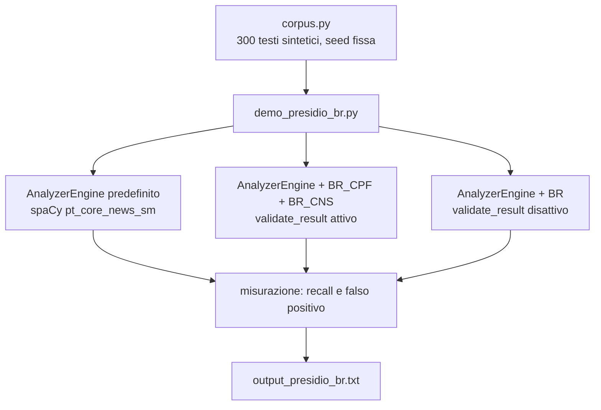

<div align="center">

# 🛡️ Presidio + riconoscitori BR — Documentazione completa in EN

[← Torna al README della demo](../README.md) · [🇬🇧 English](README.en.md) · [🇧🇷 Português](README.pt.md) · [🇪🇸 Español](README.es.md)

</div>

---

## 📋 Indice

- [Il problema](#-il-problema)
- [Architettura](#-architettura)
- [Prerequisiti](#-prerequisiti)
- [Passo per passo](#-passo-per-passo)
- [Percorso nel codice](#-percorso-nel-codice)
- [Output atteso](#-output-atteso)
- [Perché la cifra di controllo vive nel riconoscitore](#-perche-la-cifra-di-controllo-vive-nel-riconoscitore)
- [Limiti](#-limiti)
- [Risoluzione dei problemi](#-risoluzione-dei-problemi)
- [Prossimi passi](#-prossimi-passi)

---

## 🔎 Il problema

[Microsoft Presidio](https://github.com/data-privacy-stack/presidio) è l'SDK open-source più usato per individuare e anonimizzare i PII in un testo prima di inviarlo a un LLM. Include riconoscitori specifici per 18 paesi (Italia, Spagna, India, Polonia, Australia...). Nessuno per il Brasile, nessuno per l'America Latina.

In pratica: costruisci la pipeline, fai passare una nota infermieristica in portoghese attraverso l'anonimizzatore, e il CPF (CPF = codice fiscale individuale brasiliano) esce intatto dall'altra parte. Il nome diventa `<PERSON>` perché spaCy riconosce i nomi. Il CPF non è un'entità che Presidio conosce, quindi non c'è nulla da segnalare.

Peggio: quando il numero ha 11 cifre senza punteggiatura, il riconoscitore di telefono (che gira con la regione BR attiva di default) a volte lo intercetta. In questa misurazione, 17 su 200 CPF/CNS (CNS = Tessera Sanitaria Nazionale) sono diventati `PHONE_NUMBER`. Anonimizza, ma con l'etichetta sbagliata, e non puoi fidarti del risultato.

---

## 🏗️ Architettura



Tre motori, stesso corpus. La differenza tra A2 e A3 è una riga: `validate_result()` restituisce `None` (resta il punteggio del regex) oppure `True`/`False` (punteggio 1.0 o scarto).

---

## ⚙️ Prerequisiti

- Python 3.10+
- Presidio 2.2.364 (fissato in `requirements.txt`; è la release di luglio/2026)
- Modello spaCy `pt_core_news_sm`

Niente FHIR, niente Ollama. Questa demo gira da sola, su CPU, in circa 20 secondi.

---

## 🚀 Passo per passo

```bash
cd demos/04-presidio-br
pip install -r requirements.txt
python3 -m spacy download pt_core_news_sm

# 1. Esegui la misurazione
python3 demo_presidio_br.py

# 2. Esegui i test
python3 -m pytest tests/
```

Lo script stampa la scena (testo prima e dopo l'anonimizzatore, con e senza i riconoscitori), la tabella dei risultati e come Presidio predefinito ha chiamato il numero quando ha sbagliato. Scrive anche `output_presidio_br.txt` (ignorato da git).

---

## 🧭 Percorso nel codice

### `presidio_br/validators.py`

Solo aritmetica, nessuna dipendenza da Presidio.

`validar_cpf()` calcola le due cifre di controllo con la regola mod 11 e scarta le sequenze ripetute (`111.111.111-11` torna con i conti, ma la Receita Federal non lo emette mai).

`validar_cns()` gestisce i due tipi di CNS (Tessera Sanitaria Nazionale): quella definitiva (inizia con 1 o 2, derivata dal PIS — PIS è il numero di registrazione lavorativa —, le prime 11 cifre generano le 4 finali) e quella provvisoria (inizia con 7, 8 o 9, una somma pesata con pesi 15..1 deve essere multipla di 11).

### `presidio_br/recognizers.py`

`BrCpfRecognizer` e `BrCnsRecognizer` ereditano da `PatternRecognizer`, come i riconoscitori nativi (`ItFiscalCodeRecognizer`, `EsNifRecognizer`). Ognuno ha:

- due oggetti `Pattern` (con e senza punteggiatura), con un punteggio basso di proposito;
- una lista `CONTEXT` ("cpf", "cartão sus"...) che Presidio usa per alzare il punteggio quando la parola compare vicino;
- il `validate_result()`, che esegue il validatore e restituisce `True`, `False` o `None`.

Il parametro `validar=False` esiste solo per la demo: disattiva la cifra di controllo e mostra cosa succede.

### `corpus.py`

Genera 100 frasi con CPF valido, 100 con CNS valido e 100 con un numero di 11 cifre che **non** è un CPF (protocollo, fattura, lotto, CPF digitato male). Tutto costruito con `random.Random(2026)`: nessun numero appartiene a una persona reale. Metà dei CPF esce con la punteggiatura, metà dei CNS esce con gli spazi, per coprire entrambi i regex.

### `demo_presidio_br.py`

Costruisce l'`AnalyzerEngine` in portoghese (senza `NlpEngineProvider` impostato su `pt_core_news_sm`, Presidio non carica nemmeno la lingua), misura il recall per fascia e conta i falsi positivi sui distrattori. La misurazione guarda solo lo span del numero: se l'entità giusta copre il numero, è un successo; il resto diventa "cosa ha chiamato Presidio".

---

## 📤 Output atteso

```
texto de entrada
  Paciente Eduardo O., CPF 158.813.998-03, admitida na enfermaria com dispneia aos esforços.
depois do anonimizador
  <PERSON>, CPF 158.813.998-03, admitida na enfermaria com dispneia aos esforços.

mesmo texto, depois do anonimizador (com BR_CPF + BR_CNS)
  <PERSON>, CPF <BR_CPF>, admitida na enfermaria com dispneia aos esforços.

┃ Medida                                  ┃ Presidio padrão ┃ + BR só regex ┃ + BR com DV ┃
│ Recall BR_CPF (100 CPFs válidos)        │           0/100 │             — │     100/100 │
│ Recall BR_CNS (100 CNSs válidos)        │           0/100 │             — │     100/100 │
│ Falso positivo BR_CPF (100 distratores) │               — │       100/100 │       0/100 │

O que o Presidio padrão chamou o CPF/CNS quando não achou:
  PHONE_NUMBER: 17 de 200
  PERSON: 1 de 200
```

---

## 🧮 Perché la cifra di controllo vive nel riconoscitore

La tentazione è risolvere tutto con un regex: `\d{3}\.\d{3}\.\d{3}-\d{2}` trova il CPF con la punteggiatura, `\d{11}` trova il resto. Funziona sulla carta. In produzione, ogni numero di 11 cifre dell'ospedale diventa un CPF: numero d'ordine, lotto di siero, ordine di servizio. La colonna "+ BR solo regex" lo dimostra: 100 su 100 distrattori segnalati.

Presidio ha già l'aggancio giusto per questo. Nel `PatternRecognizer`, dopo ogni match, chiama `validate_result(testo_del_match)`:

- `True` → il punteggio sale a 1.0
- `False` → il risultato viene scartato
- `None` → resta il punteggio del regex

È esattamente quello che fanno il riconoscitore del codice fiscale italiano e quello del NIF spagnolo. Il CPF ha una cifra di controllo mod 11 da sempre; anche il CNS. Basta usarla. Con questo la colonna dei falsi positivi scende a 0 senza toccare il recall.

Una conseguenza pratica: il punteggio 1.0 fa vincere `BR_CPF` su `PHONE_NUMBER` quando entrambi coprono lo stesso span. L'anonimizzatore sceglie quello con il punteggio più alto, e il testo esce con `<BR_CPF>`, non con `<PHONE_NUMBER>`.

---

## ⚠️ Limiti

- **Corpus sintetico e pulito.** Niente OCR, niente andata a capo in mezzo al numero, nessun dato reale. Il 100/100 non si generalizza a una cartella clinica vera; è il tetto di ciò che fa il riconoscitore quando il numero è ben formato.
- **CPF scritto per esteso** ("centocinquantotto milioni...") resta fuori.
- **CRM** (registro del medico) non è ancora incluso.
- `pt_core_news_sm` etichetta "cartão SUS" come `ORGANIZATION` in alcune frasi. Non compromette l'anonimizzazione; sporca la metrica di chi misura il NER.
- `PhoneRecognizer` continua a segnalare gli stessi 17 numeri come telefono. `BR_CPF` vince per punteggio, ma il risultato doppio compare comunque nell'elenco dell'analyzer.

---

## 🔧 Risoluzione dei problemi

**`OSError: [E050] Can't find model 'pt_core_news_sm'`**
Esegui `python3 -m spacy download pt_core_news_sm`.

**`ValueError: No matching recognizers were found for the specified language: pt`**
Manca `supported_languages=["pt"]` passato all'`AnalyzerEngine`. Guarda `criar_analyzer()`.

**Recall sotto 100 sul tuo testo**
Controlla se il numero soddisfa i conti della cifra di controllo. I CPF di esempio dei siti web sono spesso invalidi di proposito.

---

## 🔮 Prossimi passi

- PR upstream verso [`data-privacy-stack/presidio`](https://github.com/data-privacy-stack/presidio) come `country_specific/brazil` (paese 19, il primo dell'America Latina). Il progetto è passato da Microsoft a una governance comunitaria a giugno/2026, e il comitato tecnico si sta aprendo ai contributi esterni.
- Riconoscitore CRM con codice di stato (UF).
- Misurazione su testo sintetico sporco (OCR, andata a capo, cifra per esteso).
- Integrazione nella pipeline di NursIA prima che entri qualsiasi dato reale.
