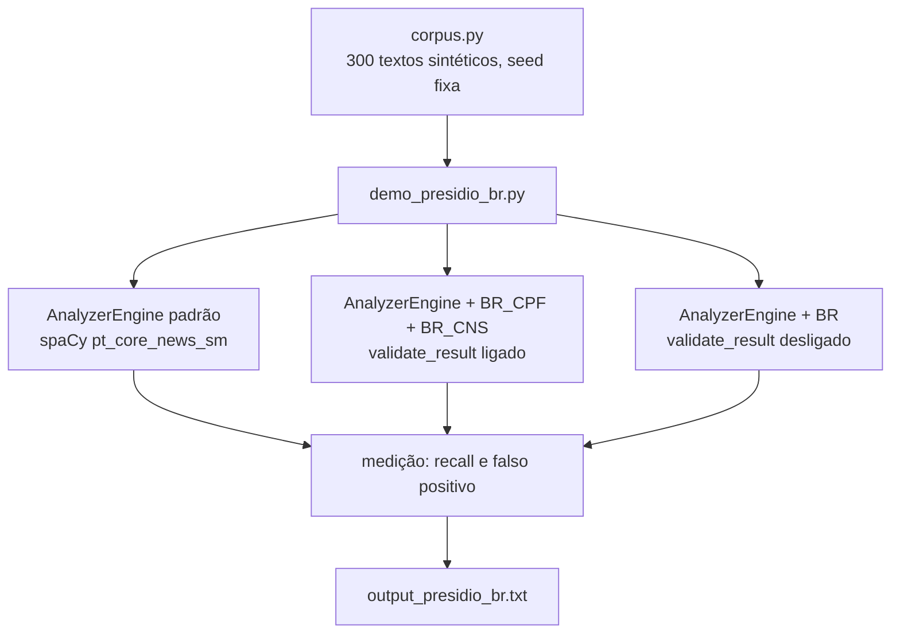

<div align="center">

# 🛡️ Presidio + reconhecedores BR — Documentação completa em PT

[← Voltar pro README da demo](../README.md) · [🇬🇧 English](README.en.md) · [🇪🇸 Español](README.es.md) · [🇮🇹 Italiano](README.it.md)

</div>

---

## 📋 Índice

- [O problema](#-o-problema)
- [Arquitetura](#-arquitetura)
- [Pré-requisitos](#-pre-requisitos)
- [Passo a passo](#-passo-a-passo)
- [Walkthrough do código](#-walkthrough-do-codigo)
- [Saída esperada](#-saida-esperada)
- [Por que o dígito verificador mora no reconhecedor](#-por-que-o-digito-verificador-mora-no-reconhecedor)
- [Limites](#-limites)
- [Troubleshooting](#-troubleshooting)
- [Próximos passos](#-proximos-passos)

---

## 🔎 O problema

O [Microsoft Presidio](https://github.com/data-privacy-stack/presidio) é o SDK open-source mais usado pra detectar e anonimizar PII em texto antes de mandar pra um LLM. Ele traz reconhecedores específicos de país pra 18 países (Itália, Espanha, Índia, Polônia, Austrália...). Nenhum pro Brasil, nenhum pra América Latina.

Na prática: você monta o pipeline, passa uma evolução de enfermagem em português pelo anonimizador e o CPF sai inteiro do outro lado. O nome vira `<PERSON>` porque o spaCy conhece nome. O CPF não é entidade que o Presidio conheça, então não tem o que marcar.

Pior: quando o número tem 11 dígitos sem pontuação, o reconhecedor de telefone (que roda com a região BR ligada por padrão) às vezes pega. Nesta medição, 17 dos 200 CPF/CNS viraram `PHONE_NUMBER`. Anonimiza, mas com o rótulo errado, e você não consegue confiar no que sai.

---

## 🏗️ Arquitetura



Três engines, mesmo corpus. A diferença entre A2 e A3 é uma linha: o `validate_result()` devolve `None` (fica o score do regex) ou `True/False` (score 1.0 ou descarte).

---

## ⚙️ Pré-requisitos

- Python 3.10+
- Presidio 2.2.364 (fixado no `requirements.txt`; é a release de julho/2026)
- Modelo spaCy `pt_core_news_sm`

Nada de FHIR, nada de Ollama. Esta demo roda sozinha, na CPU, em uns 20 segundos.

---

## 🚀 Passo a passo

```bash
cd demos/04-presidio-br
pip install -r requirements.txt
python3 -m spacy download pt_core_news_sm

# 1. Roda a medição
python3 demo_presidio_br.py

# 2. Roda os testes
python3 -m pytest tests/
```

O script imprime a cena (texto antes e depois do anonimizador, com e sem os reconhecedores), a tabela de resultado e o que o Presidio padrão chamou o número quando errou. Também escreve `output_presidio_br.txt` (ignorado pelo git).

---

## 🧭 Walkthrough do código

### `presidio_br/validators.py`

Só aritmética, sem dependência do Presidio.

`validar_cpf()` calcula os dois dígitos verificadores pela regra mod 11 e rejeita sequências repetidas (`111.111.111-11` fecha a conta, mas a Receita não emite).

`validar_cns()` trata os dois tipos de Cartão Nacional de Saúde: o definitivo (começa com 1 ou 2, derivado do PIS, os 11 primeiros dígitos geram os 4 finais) e o provisório (começa com 7, 8 ou 9, soma ponderada com pesos 15..1 tem que ser múltipla de 11).

### `presidio_br/recognizers.py`

`BrCpfRecognizer` e `BrCnsRecognizer` herdam de `PatternRecognizer`, igual aos reconhecedores nativos (`ItFiscalCodeRecognizer`, `EsNifRecognizer`). Cada um tem:

- dois `Pattern` (com e sem pontuação), com score baixo de propósito;
- uma lista `CONTEXT` ("cpf", "cartão sus"...) que o Presidio usa pra subir o score quando a palavra aparece perto;
- o `validate_result()`, que roda o validador e devolve `True`, `False` ou `None`.

O parâmetro `validar=False` existe só pra demo: desliga o dígito verificador e mostra o que acontece.

### `corpus.py`

Gera 100 frases com CPF válido, 100 com CNS válido e 100 com um número de 11 dígitos que **não** é CPF (protocolo, nota fiscal, lote, CPF digitado errado). Tudo por construção, com `random.Random(2026)`: nenhum número pertence a alguém. Metade dos CPFs sai pontuado, metade dos CNSs sai com espaços, pra cobrir os dois regex.

### `demo_presidio_br.py`

Monta o `AnalyzerEngine` em português (sem `NlpEngineProvider` com `pt_core_news_sm` o Presidio nem carrega o idioma), mede recall por fatia e conta falso positivo nos distratores. A medição olha só o span do número: se a entidade certa cobre o número, é acerto; o resto vira "o que o Presidio chamou".

---

## 📤 Saída esperada

```
texto de entrada
  Paciente Eduardo O., CPF 158.813.998-03, admitida na enfermaria com dispneia aos esforços.
depois do anonimizador
  <PERSON>, CPF 158.813.998-03, admitida na enfermaria com dispneia aos esforços.

mesmo texto, depois do anonimizador (com BR_CPF + BR_CNS)
  <PERSON>, CPF <BR_CPF>, admitida na enfermaria com dispneia aos esforços.

┃ Medida                                  ┃ Presidio padrão ┃ + BR só regex ┃ + BR com DV ┃
│ Recall BR_CPF (100 CPFs válidos)        │           0/100 │             — │     100/100 │
│ Recall BR_CNS (100 CNSs válidos)        │           0/100 │             — │     100/100 │
│ Falso positivo BR_CPF (100 distratores) │               — │       100/100 │       0/100 │

O que o Presidio padrão chamou o CPF/CNS quando não achou:
  PHONE_NUMBER: 17 de 200
  PERSON: 1 de 200
```

---

## 🧮 Por que o dígito verificador mora no reconhecedor

A tentação é resolver com regex e pronto: `\d{3}\.\d{3}\.\d{3}-\d{2}` acha CPF pontuado, `\d{11}` acha o resto. Funciona no teste de mesa. Em produção, todo número de 11 dígitos do hospital vira CPF: número de pedido, lote de soro, ordem de serviço. A coluna "+ BR só regex" mostra: 100 de 100 distratores marcados.

O Presidio já tem o gancho certo pra isso. No `PatternRecognizer`, depois de cada match, ele chama `validate_result(texto_do_match)`:

- `True` → score sobe pra 1.0
- `False` → resultado descartado
- `None` → fica o score do regex

É exatamente o que os reconhecedores de código fiscal italiano e NIF espanhol fazem. O CPF tem dígito verificador mod 11 desde sempre; o CNS também. É só usar. Com isso a coluna de falso positivo vai a 0 sem tocar no recall.

Uma consequência prática: o score 1.0 faz o `BR_CPF` ganhar do `PHONE_NUMBER` quando os dois cobrem o mesmo span. O anonimizador escolhe o de maior score, e o texto sai com `<BR_CPF>`, não `<PHONE_NUMBER>`.

---

## ⚠️ Limites

- **Corpus sintético e limpo.** Sem OCR, sem quebra de linha no meio do número, sem dado real. O 100/100 não generaliza pra prontuário de verdade; é o teto do que o reconhecedor faz quando o número está bem formado.
- **CPF por extenso** ("cento e cinquenta e oito milhões...") fica de fora.
- **CRM** (registro do médico) não entra ainda.
- O `pt_core_news_sm` marca "cartão SUS" como `ORGANIZATION` em algumas frases. Não atrapalha a anonimização; suja a métrica de quem for medir NER.
- O `PhoneRecognizer` continua marcando os mesmos 17 números como telefone. O `BR_CPF` ganha por score, mas o resultado duplo aparece na lista do analyzer.

---

## 🔧 Troubleshooting

**`OSError: [E050] Can't find model 'pt_core_news_sm'`**
Rode `python3 -m spacy download pt_core_news_sm`.

**`ValueError: No matching recognizers were found for the specified language: pt`**
Faltou passar `supported_languages=["pt"]` no `AnalyzerEngine`. Veja `criar_analyzer()`.

**Recall abaixo de 100 no seu texto**
Confira se o número fecha a conta do dígito verificador. CPF de exemplo de site costuma ser inválido de propósito.

---

## 🔮 Próximos passos

- PR upstream pro [`data-privacy-stack/presidio`](https://github.com/data-privacy-stack/presidio) como `country_specific/brazil` (país 19, o primeiro da América Latina). O projeto saiu da Microsoft pra governança comunitária em junho/2026 e o comitê técnico está abrindo pra contribuição externa.
- Reconhecedor de CRM com UF.
- Medição em texto sintético sujo (OCR, quebra de linha, dígito por extenso).
- Ligação no pipeline do NursIA antes de qualquer dado real entrar.
