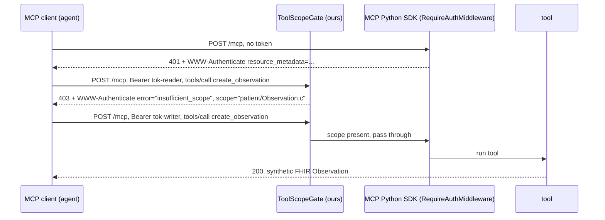

# 05 · MCP scopes per tool, mapped to SMART on FHIR

An MCP server with two tools and two SMART on FHIR v2 scopes. A token that can read a Patient gets HTTP 403 when it tries to create an Observation, with the `WWW-Authenticate` challenge the spec asks for. The MCP Python SDK checks scopes at the door; the per-tool refusal is 36 lines of ours.

[Português abaixo](#pt-br)

## Try it

```bash
pip install -r requirements.txt
python3 -m pytest tests -q -s
python3 demo.py          # the same 4 requests, narrated: who calls, which tool, which HTTP status
python3 server.py        # optional: keep it running and poke it with curl
```

Expected output (2026-09-15, mcp 1.27.0):

```
statuses=[401, 200, 403, 200] refused=2/4 (1x401 no token, 1x403 wrong scope)
7 passed in 1.00s
```

## What it does



The scope map is the whole idea:

```python
TOOL_SCOPES = {
    "read_patient": "patient/Patient.r",
    "create_observation": "patient/Observation.c",
}
```

Same grammar SMART on FHIR uses (`patient/<Resource>.<cruds>`), applied to MCP tools instead of FHIR endpoints.

## What I measured

| Request | Token scopes | Result |
|---|---|---|
| read_patient | none | 401, `resource_metadata` pointer |
| read_patient | patient/Patient.r | 200 |
| create_observation | patient/Patient.r | 403, `scope="patient/Observation.c"` |
| create_observation | patient/Patient.r patient/Observation.c | 200 |

Raw headers in `docs/evidence-2026-09-15.md`.

## Limits, honestly

- `AuthSettings.required_scopes` in the SDK is server-wide. There is no per-tool hook, so the gate reads the JSON-RPC body to find the tool name and is inserted on the `/mcp` route after `streamable_http_app()` builds it. That is a reach into the route object, not a public API. It may break on an SDK bump.
- The SDK's own 403 puts the missing scope in `error_description` prose ("Required scope: ..."), not in the `scope=` parameter of `WWW-Authenticate`. The spec (2026-07-28, Scope Challenge Handling) says the server SHOULD send `scope=`. A client doing step-up authorization cannot parse prose. Our gate sends `scope=`.
- Tokens are static strings. No login, no consent, no issuance. A real MCP server verifies a JWT from a separate authorization server and never issues tokens (it is an OAuth 2.1 resource server only).
- Authorization only applies to HTTP transports. Over stdio the token is always `None` and none of this runs.
- Scope hierarchies (`patient/Patient.cruds` implying `patient/Patient.r`) are not implemented. The spec says servers MUST account for them. Left out on purpose to keep the demo readable.
- Nothing is persisted. `create_observation` returns a synthetic resource and forgets it.

## Privacy

All data is synthetic by construction. The Patient is named "Paciente Sintetico". The gate reads the request body only to find the tool name and never logs it. No token is written anywhere.

## Sources

- MCP specification 2026-07-28, Authorization: Roles, Error Handling, Scope Challenge Handling. https://modelcontextprotocol.io/specification/2026-07-28/basic/authorization
- MCP Python SDK 1.27.0, `mcp.server.auth` (`TokenVerifier`, `AuthSettings`, `RequireAuthMiddleware`). https://github.com/modelcontextprotocol/python-sdk
- SMART App Launch 2.x, scopes and launch context. https://hl7.org/fhir/smart-app-launch/scopes-and-launch-context.html
- RFC 6750 §3.1 (`insufficient_scope`), RFC 9728 (Protected Resource Metadata).

## Cite

Rodrigues, R. (2026). MCP scopes per tool, mapped to SMART on FHIR. NursIA Research Lab, demo 05. https://github.com/rogeriorrodrigues/nursia-research-lab/tree/main/demos/05-mcp-scopes-smart-on-fhir

Part of the NursIA project (PPGINFOS/UFSC, FAPESC scholarship). License: MIT.

---

<a id="pt-br"></a>
## PT-BR

Um servidor MCP com duas ferramentas e dois scopes SMART on FHIR v2. O token que lê Patient toma HTTP 403 quando tenta criar Observation, com o `WWW-Authenticate` que a spec pede. O SDK oficial em Python confere scope na porta do servidor; a recusa por ferramenta são 36 linhas nossas.

Rodar: `pip install -r requirements.txt` e `python3 -m pytest tests -q -s`. Saída esperada: `statuses=[401, 200, 403, 200]`. `python3 demo.py` mostra as mesmas 4 chamadas narradas (quem chama, qual ferramenta, qual status HTTP).

O que medi: 4 chamadas, 2 recusadas (1 por falta de token, 1 por scope errado). Headers crus em `docs/evidence-2026-09-15.md`.

Limites: o SDK só tem `required_scopes` pro servidor inteiro, então o gate lê o corpo JSON-RPC pra achar o nome da ferramenta e é inserido na rota `/mcp` depois que o SDK a monta (pode quebrar em versão nova). O 403 do próprio SDK põe o scope faltante em `error_description`, não no parâmetro `scope=` que a spec diz que o servidor DEVERIA mandar. Token aqui é string fixa, sem login nem emissão. Só vale em transporte HTTP. Hierarquia de scope não implementada.

Dado 100% sintético. Projeto NursIA (PPGINFOS/UFSC, bolsa FAPESC). Licença MIT.
