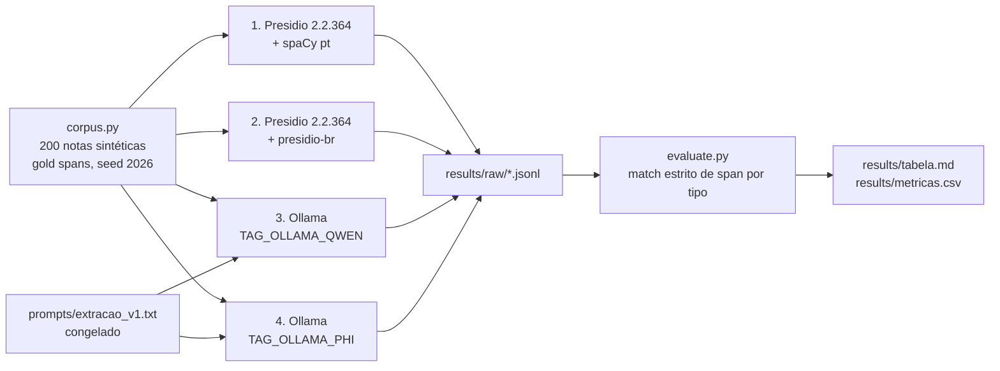

# 06 · Anonymization of Portuguese clinical notes: how much leaks through

Four anonymization systems run on the same 200 synthetic Portuguese clinical notes, and the question is how much personal data each one lets through. Default Presidio leaves a CPF or CNS undetected in 200 of 200 notes; with the Brazilian recognizers from demo 04 that drops to 0 of 200, a local Qwen3.8 27B (Q4_K_M, via Ollama) also leaks 0 of 200 with strict-span F1 99.9% at 12.4 s per note, and a local Phi-4 14B leaks 4 of 200 at 5.1 s per note because it rewrites the number it found.

[Português abaixo](#pt-br)

## Try it

Systems 1 and 2, CPU only, no Ollama (this is what CI runs):

```bash
pip install -r requirements.txt
python3 -m pytest tests -q -s -rs   # corpus, metric, Presidio default and Presidio + presidio-br
python3 evaluate.py                 # rewrites results/tabela.md and results/metricas.csv
```

Systems 3 and 4, local LLMs through Ollama (can take hours; the run is resumable):

```bash
cp .env.example .env                 # OLLAMA_HOST, TAG_OLLAMA_QWEN, TAG_OLLAMA_PHI
ollama pull qwen3.8:27b && ollama pull phi4:14b
python3 run_llms.py                  # or: python3 run_llms.py ollama_qwen
python3 evaluate.py
```

`run_llms.py` stops if a tag is missing from `ollama list` or larger than the machine's RAM. It never swaps models, because swapping the model changes the post.

## What it does



**Corpus.** 200 notes, 3 to 6 sentences each, in four styles (nursing progress note, discharge, referral, prescription), 50 of each. Seven entity types with character offsets: PESSOA, BR_CPF, BR_CNS, DATA, TELEFONE, EMAIL, ENDERECO. Every note has at least one CPF or CNS. Hard cases are built in on purpose:

| Hard case | Proportion |
|---|---|
| CPF without punctuation | 66/133 CPFs (49.6%) |
| CNS without spaces | 73/120 CNSs (60.8%) |
| Date written out ("3 de março") | 50/98 dates (51.0%) |
| Phone without area code | 33/60 phones (55.0%) |
| Composite first name ("Maria Clara") | 151/292 person mentions (51.7%) |
| Surname that is also a common word (Rosa, Pereira, Machado) | 144/292 person mentions (49.3%) |
| Drug name that looks like a first name (Yasmin, Diane 35, Selene, Elani) | 20/200 notes |
| Numbers that are NOT personal data (lot, protocol, PA 150x95, dose, bed) | 197 in 200 notes |

`python3 corpus.py` prints these and writes `data/corpus.jsonl` with every span, for audit. CPF and CNS numbers pass the check digit (same arithmetic as demo 04) and are drawn at random with a fixed seed: they are synthetic and belong to no one. Names, streets and phones come from short invented lists; any match with a real person is coincidence.

**Systems.** Presidio is the `data-privacy-stack/presidio` project, version 2.2.364, with spaCy `pt_core_news_sm` 3.8.0. System 2 adds `BR_CPF` and `BR_CNS` from `demos/04-presidio-br/presidio_br` by relative import (`demo04.py`), nothing rewritten. Presidio entities are mapped to the gold types (PERSON to PESSOA, DATE_TIME to DATA, PHONE_NUMBER to TELEFONE, EMAIL_ADDRESS to EMAIL, LOCATION to ENDERECO); anything else Presidio returns (URL, ORGANIZATION, NRP) is dropped before scoring. Systems 3 and 4 call Ollama 0.34.2's `/api/chat` directly with `format: json`, `temperature 0`, `seed 2026`, `think: false`, one prompt for both models. The prompt was written before any model ran and is frozen; if it ever changes, the new file is `extracao_v2.txt` and both go here.

**Metric.** Strict span match by type: `(start, end, type)` has to be exact. A partial span ("Ana" for "Ana Rosa") counts as one false positive and one false negative. The headline is the leak rate: share of notes where at least one CPF or CNS survived undetected. False positives on the numeric distractors are counted separately. An LLM answer that is not valid JSON counts as zero entities and goes into the parse-failure rate.

## What I measured

Run on 2026-09-21, Apple M4 Max, 36 GB, Python 3.11.9. Literal copy of `results/tabela.md`:

| Sistema | Notas | P | R | F1 micro | Recall CPF | Recall CNS | Vazamento CPF/CNS | FP em distratores | Pior entidade | Tempo/nota | Falha parse |
|---|---|---|---|---|---|---|---|---|---|---|---|
| Presidio 2.2.364 padrão + spaCy pt | 200/200 | 43.3% | 43.3% | 43.3% | 0.0% | 0.0% | 100.0% (200/200) | 49 | BR_CPF (0.0%) | 0.01 s | n/a |
| Presidio 2.2.364 + presidio-br | 200/200 | 57.1% | 75.5% | 65.0% | 100.0% | 100.0% | 0.0% (0/200) | 49 | ENDERECO (0.0%) | 0.01 s | n/a |
| Ollama (Qwen) `qwen3.8:27b` (Q4_K_M) | 200/200 | 99.9% | 100.0% | 99.9% | 100.0% | 100.0% | 0.0% (0/200) | 1 | PESSOA (99.8%) | 12.38 s | 0.0% |
| Ollama (Phi) `phi4:14b` (Q4_K_M) | 200/200 | 100.0% | 97.8% | 98.9% | 97.7% | 99.2% | 2.0% (4/200) | 0 | ENDERECO (90.6%) | 5.08 s | 0.0% |

| Entidade (suporte) | Presidio 2.2.364 padrão + spaCy pt | Presidio 2.2.364 + presidio-br | Ollama (Qwen) | Ollama (Phi) |
|---|---|---|---|---|
| PESSOA (292) | P 66.9% R 82.2% F1 73.7% | P 66.9% R 82.2% F1 73.7% | P 99.7% R 100.0% F1 99.8% | P 100.0% R 100.0% F1 100.0% |
| BR_CPF (133) | P 0.0% R 0.0% F1 0.0% | P 100.0% R 100.0% F1 100.0% | P 100.0% R 100.0% F1 100.0% | P 100.0% R 97.7% F1 98.9% |
| BR_CNS (120) | P 0.0% R 0.0% F1 0.0% | P 100.0% R 100.0% F1 100.0% | P 100.0% R 100.0% F1 100.0% | P 100.0% R 99.2% F1 99.6% |
| DATA (98) | P 100.0% R 49.0% F1 65.8% | P 100.0% R 49.0% F1 65.8% | P 100.0% R 100.0% F1 100.0% | P 100.0% R 96.9% F1 98.4% |
| TELEFONE (60) | P 45.8% R 45.0% F1 45.4% | P 45.8% R 45.0% F1 45.4% | P 100.0% R 100.0% F1 100.0% | P 100.0% R 100.0% F1 100.0% |
| EMAIL (26) | P 100.0% R 100.0% F1 100.0% | P 100.0% R 100.0% F1 100.0% | P 100.0% R 100.0% F1 100.0% | P 100.0% R 100.0% F1 100.0% |
| ENDERECO (58) | P 0.0% R 0.0% F1 0.0% | P 0.0% R 0.0% F1 0.0% | P 100.0% R 100.0% F1 100.0% | P 100.0% R 82.8% F1 90.6% |

What the Presidio rows say, read from `results/raw/`:

- Default Presidio finds no CPF and no CNS as such. Unpunctuated CPFs come back as PHONE_NUMBER, which is why TELEFONE precision is 45.8%. The 11-digit protocol numbers (invalid CPFs by check digit) never become BR_CPF in system 2: precision 100%.
- DATA recall is 49.0% in both: numeric dates are found, dates written out ("27 de novembro") are not.
- ENDERECO is 0% under strict match because spaCy splits "Rua do Mirante, 102, Campeche" into two or three LOCATION spans. The same NER tags sentence-initial words ("Transferência", "Reside", "Glicemia") and "PA" as LOCATION, and "Deambula", "VO" and "Cartão SUS" as PERSON.
- The 49 distractor hits are the same in both systems: the four brand-name drugs (20 of 20) and the blood pressure "150x95" (20 of 26) are tagged, the presidio-br recognizers add none.

What the Qwen row says, from `results/raw/ollama_qwen.jsonl` and its `.meta.json`:

- `qwen3.8:27b` is the Ollama default tag, Q4_K_M, 16.5 GB, digest `22130167c4c2`, family qwen35, run with `think: false`. Pulling it required upgrading Ollama from 0.12.2 to 0.34.2.
- Valid JSON in 200 of 200 answers, and every returned text was found verbatim in its note. Recall 100% on all seven types, including dates written out, phones without area code and full addresses, which are exactly where Presidio failed.
- The single error in 787 gold spans: the contraceptive brand "Elani" tagged as PESSOA once (the other 19 brand-name drug mentions were left alone). Median 12.2 s per note, min 6.4 s, max 27.6 s (first note, model load); 41 minutes for the 200 notes on the M4 Max.

What the Phi row says, from `results/raw/ollama_phi.jsonl`:

- `phi4:14b` is the Ollama default tag, Q4_K_M, 8.4 GB, family phi3, 14.7B parameters. Valid JSON in 200 of 200 answers, zero false positives, zero hits on distractors. Median 5.0 s per note, 17 minutes for the 200.
- The 4 leaked notes are all the same failure: the model found the document but returned it normalized. A CNS written "197 6582 8025 0003" came back as "197658280250003"; a CPF written "81013315650" came back as "810.133.156-50". The prompt asks for the exact copy, the text search finds nothing, the span does not exist, and the number survives in the anonymized note. A model that rewrites what it extracts breaks span-based anonymization even when it recognized the entity.
- The other misses are 10 of 58 addresses (returned partially or skipped) and 3 of 98 dates written out. ENDERECO is its worst entity at F1 90.6%.

## What this does not prove

- A synthetic corpus is cleaner than a real record: no OCR noise, no typos, no line breaks inside a number, no abbreviations the template did not contain. Every number here is an upper bound.
- n=200 does not separate small differences. A gap of a few points between two systems is inside the noise of this corpus.
- This corpus is not the one in the reference papers, so the 0.726 F1 reported for anonymization of Portuguese clinical notes with a 70B model (JMIR 2026, DOI 10.2196/91513) is a reference point, not an adversary. Local 8B to 24B models are studied in DOI 10.2196/86453. Numbers are not compared head to head across corpora.
- The corpus is too easy for a 27B model. With F1 99.9% the Qwen row sits on the ceiling, so this corpus cannot rank LLMs against each other. The one point it does separate is behavior, not knowledge: Phi-4 loses 4 notes by normalizing numbers, not by failing to see them. Template-generated text with a fixed set of entity formats is exactly what a large model handles; the Presidio numbers are informative because they are far from that ceiling.
- Quantization changes what an LLM finds. The Ollama default tags are quantized; the digest and quantization level are logged, and a different quant is a different system.
- Strict span match is harsh on systems that find the right thing with the wrong boundary. It is the honest metric for an anonymizer (a half-masked name is a leak) but it is not the only one.

## Privacy

Nothing leaves the machine: Presidio and spaCy run on the CPU, Ollama runs on `OLLAMA_HOST` (local by default), and no cloud service is called. The code never logs note text outside `results/`; raw model answers are stored only in `results/raw/`. All data is synthetic by construction (seed 2026).

## Sources

- Anonymization of Portuguese clinical notes with LLMs. JMIR, 2026. DOI 10.2196/91513
- Xu et al. Local 8B to 24B models for clinical de-identification. JMIR, 2026. DOI 10.2196/86453
- Presidio, `data-privacy-stack/presidio`, 2.2.364. https://github.com/data-privacy-stack/presidio
- Demo 04 of this repository, `presidio_br` recognizers: `demos/04-presidio-br`

## Cite

Rodrigues, R. (2026). Anonymization of Portuguese clinical notes: how much leaks through. NursIA Research Lab, demo 06. https://github.com/rogeriorrodrigues/nursia-research-lab/tree/main/demos/06-anonimizacao-pt

Part of the NursIA project (PPGINFOS/UFSC, FAPESC scholarship). License: MIT.

---

<a id="pt-br"></a>
## PT-BR

Quatro sistemas de anonimização rodam nas mesmas 200 notas clínicas sintéticas em português, e a pergunta é quanto dado pessoal cada um deixa passar. O Presidio padrão deixa um CPF ou CNS sem detectar em 200 de 200 notas; com os reconhecedores brasileiros da demo 04 cai pra 0 de 200, o Qwen3.8 27B local (Q4_K_M, via Ollama) também vaza 0 de 200 com F1 99,9% em match estrito a 12,4 s por nota, e o Phi-4 14B local vaza 4 de 200 a 5,1 s por nota porque reescreve o número que achou.

Rodar (CI, sem Ollama): `pip install -r requirements.txt`, `python3 -m pytest tests -q -s -rs`, `python3 evaluate.py`. LLMs: `cp .env.example .env`, `ollama pull` das duas tags, `python3 run_llms.py` (horas, resumível), `python3 evaluate.py`.

Corpus: 200 notas, 3 a 6 frases, quatro estilos (evolução de enfermagem, alta, encaminhamento, prescrição), sete tipos de entidade com offset de caractere. Casos difíceis de propósito: CPF sem pontuação (49,6%), data por extenso (51,0%), telefone sem DDD (55,0%), nome composto (51,7%), sobrenome que é palavra comum (49,3%), medicamento com cara de nome próprio (20 notas) e números que não são dado pessoal (lote, protocolo, PA, dose, leito) em 197 notas. CPF e CNS válidos pelo dígito verificador, sorteados com seed 2026: sintéticos, de ninguém.

Métrica: match estrito de span por tipo. Manchete: taxa de vazamento, notas em que pelo menos um CPF ou CNS sobreviveu. Tabela literal acima. O que a tabela diz: o Presidio padrão não acha CPF nem CNS (o CPF sem pontuação vira PHONE_NUMBER); com presidio-br, recall 100% nos dois e zero protocolo virando CPF. Data por extenso passa em branco nos dois. Endereço dá 0% no match estrito porque o spaCy quebra o endereço em dois ou três LOCATION.

Qwen: JSON válido em 200 de 200 respostas, recall 100% nos sete tipos (inclusive data por extenso, telefone sem DDD e endereço completo, onde o Presidio falha), um único erro (a marca "Elani" marcada como PESSOA uma vez), mediana de 12,2 s por nota, 41 minutos no total. Phi-4 14B (`phi4:14b`, Q4_K_M): JSON válido em 200 de 200, zero falso positivo, mediana de 5,0 s por nota, mas 4 notas vazadas pelo mesmo motivo: o modelo achou o CNS ou o CPF e devolveu normalizado ("197 6582 8025 0003" virou "197658280250003"), o texto não bate com a nota, o span não existe e o número sobrevive. Modelo que reescreve o que extrai quebra anonimização por span mesmo reconhecendo a entidade. Pior entidade: ENDERECO (F1 90,6%). O prompt (`prompts/extracao_v1.txt`) foi escrito antes e está congelado; mudou, vira `extracao_v2.txt` e as duas versões ficam aqui.

O que isso não prova: corpus sintético é mais limpo que prontuário real; com F1 99,9% o Qwen está no teto, então este corpus não serve pra comparar LLM com LLM (o que ele separa é comportamento: o Phi perde 4 notas por normalizar número, não por não ver); n=200 não separa diferença pequena; o corpus não é o dos papers (DOI 10.2196/91513, DOI 10.2196/86453), então o 0,726 é referência, não adversário; quantização muda o que o LLM acha.

Privacidade: nada sai da máquina, nenhum serviço de nuvem, o código não loga texto de nota fora de `results/`. Presidio é o projeto `data-privacy-stack/presidio`. Projeto NursIA (PPGINFOS/UFSC, bolsa FAPESC). Licença MIT.
